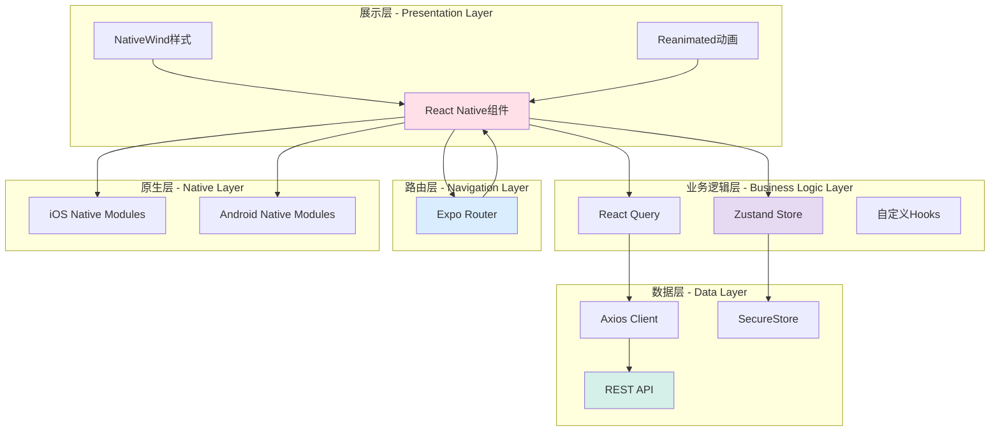
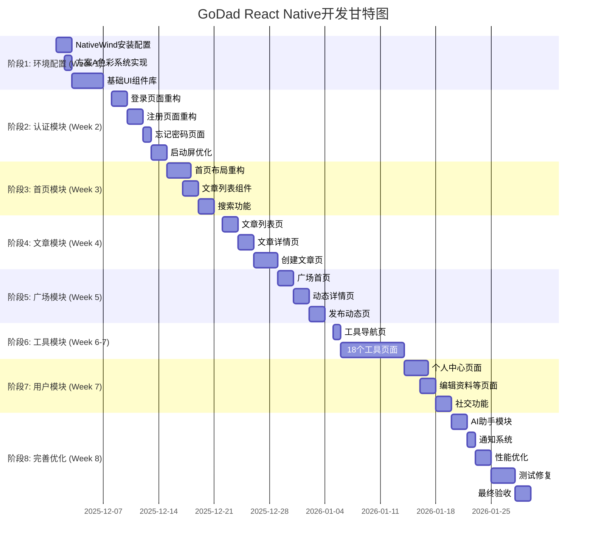

# GoDad育婴App - React Native开发实施方案

## 文档信息
- **项目名称:** GoDad育婴App（真实移动应用）
- **UI方案:** 方案A - 柔和粉彩全球标准
- **技术栈:** React Native + Expo + NativeWind
- **目标平台:** iOS (App Store) + Android (Google Play)
- **文档版本:** v1.0
- **创建日期:** 2025-11-28
- **作者:** wanglezhi
- **文档类型:** React Native开发实施方案

---

## 【细化方案 - React Native版本】

## 一、项目目标

### 1.1 核心目标

基于现有React Native项目，应用**方案A（柔和粉彩 - 全球标准）**的UI设计，开发一个：
- ✅ **真实的原生移动应用** - 可直接上架App Store和Google Play
- ✅ **国际化UI设计** - 温暖、专业、符合全球审美标准
- ✅ **完整功能实现** - 18个育婴工具 + 内容社区 + AI助手
- ✅ **高性能体验** - 流畅动画、快速响应
- ✅ **可扩展架构** - 易于维护和迭代

### 1.2 现有项目基础

**您已有的技术栈（保留）:**
```typescript
✅ React Native 0.81.5      - 原生移动开发框架
✅ Expo 54.0.25             - 开发工具和SDK
✅ TypeScript 5.9.2         - 类型系统
✅ Expo Router 6.0.15       - 路由系统
✅ Zustand 5.0.8            - 状态管理
✅ React Query 5.90.10      - 数据管理
✅ Axios 1.13.2             - HTTP客户端
✅ React Native Reanimated 4.1.5  - 动画库
```

**本次升级重点:**
```typescript
🆕 NativeWind 4.0.1         - Tailwind CSS for React Native
🎨 方案A UI设计系统          - 柔和粉彩色彩方案
♻️  UI组件库重构             - 统一设计语言
🌍 国际化支持               - 多语言、文化适配
🚀 性能优化                 - 动画、图片、列表优化
```

---

## 二、技术架构设计

### 2.1 整体架构



### 2.2 技术栈详细说明

#### 核心技术栈

| 技术 | 版本 | 用途 | 说明 |
|------|------|------|------|
| **React Native** | 0.81.5 | 跨平台框架 | 已有，保持不变 |
| **Expo** | 54.0.25 | 开发工具链 | 已有，保持不变 |
| **TypeScript** | 5.9.2 | 类型系统 | 已有，保持不变 |
| **NativeWind** | 4.0.1 | 样式系统 | 🆕 新增 - 实现方案A设计 |
| **Expo Router** | 6.0.15 | 路由管理 | 已有，保持不变 |
| **Zustand** | 5.0.8 | 状态管理 | 已有，保持不变 |
| **React Query** | 5.90.10 | 数据管理 | 已有，保持不变 |
| **React Native Reanimated** | 4.1.5 | 动画库 | 已有，增强使用 |
| **Axios** | 1.13.2 | HTTP客户端 | 已有，保持不变 |

#### 新增依赖

```json
{
  "dependencies": {
    "nativewind": "^4.0.1",
    "react-native-svg": "^15.1.0",
    "react-native-linear-gradient": "^2.8.3",
    "react-native-gesture-handler": "^2.14.1",
    "@expo/vector-icons": "^14.0.0",
    "date-fns": "^4.1.0",
    "react-native-heroicons": "^4.0.0"
  },
  "devDependencies": {
    "tailwindcss": "^3.4.1"
  }
}
```

### 2.3 项目结构（优化后）

```
/rn
├── app/                           # Expo Router页面（已有）
│   ├── /(auth)/                  # 认证模块
│   ├── /(tabs)/                  # 主Tab页面
│   ├── /tools/                   # 育婴工具
│   ├── /user/                    # 用户模块
│   ├── /article/                 # 文章模块
│   ├── /moment/                  # 动态模块
│   └── _layout.tsx
│
├── src/
│   ├── /api/                     # API层（已有，保持）
│   │   ├── http.ts
│   │   ├── auth.ts
│   │   ├── user.ts
│   │   └── ...
│   │
│   ├── /components/              # 组件库（重构）
│   │   ├── /ui/                  # 基础UI组件（新建）
│   │   │   ├── Button.tsx        # 🆕 方案A样式
│   │   │   ├── Input.tsx
│   │   │   ├── Card.tsx
│   │   │   ├── GradientCard.tsx  # 🆕 渐变卡片
│   │   │   ├── Avatar.tsx
│   │   │   ├── Badge.tsx
│   │   │   └── ...
│   │   │
│   │   ├── /cards/               # 业务卡片组件（重构）
│   │   │   ├── ArticleCard.tsx   # ♻️ 应用方案A设计
│   │   │   ├── MomentCard.tsx
│   │   │   ├── ToolCard.tsx      # 🆕 工具卡片
│   │   │   └── UserCard.tsx
│   │   │
│   │   ├── /layout/              # 布局组件（新建）
│   │   │   ├── SafeAreaView.tsx
│   │   │   ├── Container.tsx
│   │   │   ├── Header.tsx
│   │   │   └── TabBar.tsx
│   │   │
│   │   └── /feedback/            # 反馈组件（新建）
│   │       ├── LoadingSpinner.tsx
│   │       ├── EmptyState.tsx
│   │       ├── ErrorState.tsx
│   │       └── Skeleton.tsx
│   │
│   ├── /stores/                  # 状态管理（已有，保持）
│   │   ├── auth.ts
│   │   ├── notification.ts
│   │   └── index.ts
│   │
│   ├── /hooks/                   # 自定义Hooks（已有，增强）
│   │   ├── useAnimatedLike.ts    # 已有
│   │   ├── useAnimatedPress.ts   # 已有
│   │   ├── useTheme.ts           # 🆕 主题钩子
│   │   └── ...
│   │
│   ├── /types/                   # 类型定义（已有）
│   │   └── index.ts
│   │
│   ├── /constants/               # 常量配置（已有，扩展）
│   │   ├── config.ts             # 已有
│   │   ├── colors.ts             # 🆕 方案A色彩常量
│   │   └── theme.ts              # 🆕 主题配置
│   │
│   └── /utils/                   # 工具函数（已有）
│       └── ...
│
├── assets/                        # 静态资源（已有）
│   ├── icon.png
│   ├── splash-icon.png
│   └── ...
│
├── tailwind.config.js            # 🆕 Tailwind配置（方案A）
├── global.css                    # 已有
├── app.json                      # Expo配置
├── package.json
└── tsconfig.json
```

---

## 三、方案A设计系统实现

### 3.1 NativeWind配置

#### 3.1.1 安装和配置

```bash
# 1. 安装NativeWind
npm install nativewind
npm install --save-dev tailwindcss

# 2. 初始化Tailwind配置
npx tailwindcss init
```

#### 3.1.2 tailwind.config.js（方案A完整配置）

```javascript
// tailwind.config.js
/** @type {import('tailwindcss').Config} */
module.exports = {
  content: [
    "./App.{js,jsx,ts,tsx}",
    "./app/**/*.{js,jsx,ts,tsx}",
    "./src/**/*.{js,jsx,ts,tsx}"
  ],

  theme: {
    extend: {
      colors: {
        // 主品牌色 - 柔和桃粉（方案A）
        primary: {
          50: '#FFF5F3',
          100: '#FFE8E3',
          200: '#FFCFC4',
          300: '#FFB3A5',
          400: '#FF9B8A',  // 主色调
          500: '#FF8A75',
          600: '#F77665',
          700: '#E96354',
          800: '#D85444',
          900: '#C24535',
        },

        // 辅助色 - 柔和系列
        lavender: {
          DEFAULT: '#E6D9F2',
          light: '#F0E8F7',
          dark: '#D4C4E3',
        },
        mint: {
          DEFAULT: '#D4F0E8',
          light: '#E5F7F1',
          dark: '#C3E6DC',
        },
        sky: {
          DEFAULT: '#D9EDFF',
          light: '#E8F4FF',
          dark: '#C7E2F7',
        },
        butter: {
          DEFAULT: '#FFF4D9',
          light: '#FFF9E8',
          dark: '#F7EBCA',
        },
        rose: {
          DEFAULT: '#FFE0E8',
          light: '#FFF0F3',
          dark: '#F7D1DC',
        },

        // 中性色
        neutral: {
          50: '#FAFAFA',
          100: '#F5F5F5',
          200: '#E8E8E8',
          300: '#D4D4D4',
          400: '#A0A0A0',
          500: '#737373',
          600: '#525252',
          700: '#404040',
          800: '#262626',
          900: '#171717',
        },

        // 功能色 - 柔和版本
        success: '#7ED7C1',
        warning: '#FFD19A',
        error: '#FFB4AB',
        info: '#B3D9FF',
      },

      // 字体家族
      fontFamily: {
        regular: ['System'],
        medium: ['System'],
        semibold: ['System'],
        bold: ['System'],
      },

      // 间距系统（8pt网格）
      spacing: {
        0: '0px',
        1: '4px',
        2: '8px',
        3: '12px',
        4: '16px',
        5: '20px',
        6: '24px',
        8: '32px',
        10: '40px',
        12: '48px',
        16: '64px',
        20: '80px',
      },

      // 圆角系统
      borderRadius: {
        none: '0',
        sm: '4px',
        md: '8px',
        lg: '12px',
        xl: '16px',
        '2xl': '24px',
        '3xl': '32px',
        full: '9999px',
      },

      // 阴影系统
      boxShadow: {
        sm: '0 1px 2px 0 rgba(0, 0, 0, 0.05)',
        DEFAULT: '0 1px 3px 0 rgba(0, 0, 0, 0.1)',
        md: '0 4px 6px -1px rgba(0, 0, 0, 0.1)',
        lg: '0 10px 15px -3px rgba(0, 0, 0, 0.1)',
        xl: '0 20px 25px -5px rgba(0, 0, 0, 0.1)',
      },
    },
  },

  plugins: [],
}
```

#### 3.1.3 babel.config.js更新

```javascript
// babel.config.js
module.exports = function (api) {
  api.cache(true);
  return {
    presets: ['babel-preset-expo'],
    plugins: [
      'nativewind/babel',  // 🆕 添加NativeWind插件
      'react-native-reanimated/plugin',
    ],
  };
};
```

#### 3.1.4 metro.config.js更新

```javascript
// metro.config.js
const { getDefaultConfig } = require('expo/metro-config');

const config = getDefaultConfig(__dirname);

// 🆕 添加对CSS的支持
config.transformer.babelTransformerPath = require.resolve('nativewind/babel');

module.exports = config;
```

### 3.2 色彩常量定义

```typescript
// src/constants/colors.ts
export const Colors = {
  // 主色调
  primary: {
    50: '#FFF5F3',
    100: '#FFE8E3',
    200: '#FFCFC4',
    300: '#FFB3A5',
    400: '#FF9B8A',
    500: '#FF8A75',
    600: '#F77665',
    700: '#E96354',
    800: '#D85444',
    900: '#C24535',
  },

  // 辅助色
  lavender: {
    DEFAULT: '#E6D9F2',
    light: '#F0E8F7',
    dark: '#D4C4E3',
  },
  mint: {
    DEFAULT: '#D4F0E8',
    light: '#E5F7F1',
    dark: '#C3E6DC',
  },
  sky: {
    DEFAULT: '#D9EDFF',
    light: '#E8F4FF',
    dark: '#C7E2F7',
  },
  butter: {
    DEFAULT: '#FFF4D9',
    light: '#FFF9E8',
    dark: '#F7EBCA',
  },
  rose: {
    DEFAULT: '#FFE0E8',
    light: '#FFF0F3',
    dark: '#F7D1DC',
  },

  // 功能色
  success: '#7ED7C1',
  warning: '#FFD19A',
  error: '#FFB4AB',
  info: '#B3D9FF',

  // 中性色
  neutral: {
    50: '#FAFAFA',
    100: '#F5F5F5',
    200: '#E8E8E8',
    300: '#D4D4D4',
    400: '#A0A0A0',
    500: '#737373',
    600: '#525252',
    700: '#404040',
    800: '#262626',
    900: '#171717',
  },
} as const;
```

---

## 四、核心组件实现

### 4.1 Button组件（React Native版本）

```typescript
// src/components/ui/Button.tsx
import React from 'react';
import {
  TouchableOpacity,
  Text,
  ActivityIndicator,
  View,
  TouchableOpacityProps
} from 'react-native';
import Animated, {
  useAnimatedStyle,
  useSharedValue,
  withSpring,
  withTiming
} from 'react-native-reanimated';
import { LinearGradient } from 'expo-linear-gradient';

const AnimatedTouchable = Animated.createAnimatedComponent(TouchableOpacity);

interface ButtonProps extends TouchableOpacityProps {
  variant?: 'primary' | 'secondary' | 'outline' | 'ghost' | 'danger';
  size?: 'sm' | 'md' | 'lg';
  loading?: boolean;
  fullWidth?: boolean;
  icon?: React.ReactNode;
  children: React.ReactNode;
}

export const Button: React.FC<ButtonProps> = ({
  variant = 'primary',
  size = 'md',
  loading = false,
  disabled = false,
  fullWidth = false,
  icon,
  children,
  onPressIn,
  onPressOut,
  ...props
}) => {
  const scale = useSharedValue(1);

  // 按压动画
  const animatedStyle = useAnimatedStyle(() => ({
    transform: [{ scale: scale.value }],
  }));

  const handlePressIn = (e: any) => {
    scale.value = withSpring(0.96, { damping: 15 });
    onPressIn?.(e);
  };

  const handlePressOut = (e: any) => {
    scale.value = withSpring(1, { damping: 15 });
    onPressOut?.(e);
  };

  // 尺寸样式
  const sizeStyles = {
    sm: 'h-8 px-3',
    md: 'h-10 px-4',
    lg: 'h-12 px-6',
  };

  // 文本尺寸
  const textSizes = {
    sm: 'text-sm',
    md: 'text-base',
    lg: 'text-lg',
  };

  const isDisabled = disabled || loading;

  // Primary按钮使用渐变
  if (variant === 'primary') {
    return (
      <AnimatedTouchable
        style={animatedStyle}
        onPressIn={handlePressIn}
        onPressOut={handlePressOut}
        disabled={isDisabled}
        activeOpacity={0.8}
        {...props}
      >
        <LinearGradient
          colors={['#FF9B8A', '#FFB3A5']}
          start={{ x: 0, y: 0 }}
          end={{ x: 1, y: 1 }}
          className={`
            rounded-xl
            ${sizeStyles[size]}
            ${fullWidth ? 'w-full' : ''}
            ${isDisabled ? 'opacity-50' : ''}
            flex-row items-center justify-center
            shadow-lg
          `}
        >
          {loading && (
            <ActivityIndicator color="white" className="mr-2" />
          )}
          {!loading && icon && (
            <View className="mr-2">{icon}</View>
          )}
          <Text className={`${textSizes[size]} font-semibold text-white`}>
            {children}
          </Text>
        </LinearGradient>
      </AnimatedTouchable>
    );
  }

  // 其他变体样式
  const variantStyles = {
    secondary: 'bg-rose-light',
    outline: 'bg-transparent border-2 border-primary-400',
    ghost: 'bg-transparent',
    danger: 'bg-error',
  };

  const textColors = {
    primary: 'text-white',
    secondary: 'text-primary-400',
    outline: 'text-primary-400',
    ghost: 'text-primary-400',
    danger: 'text-white',
  };

  return (
    <AnimatedTouchable
      style={animatedStyle}
      onPressIn={handlePressIn}
      onPressOut={handlePressOut}
      disabled={isDisabled}
      activeOpacity={0.8}
      className={`
        rounded-xl
        ${sizeStyles[size]}
        ${variantStyles[variant]}
        ${fullWidth ? 'w-full' : ''}
        ${isDisabled ? 'opacity-50' : ''}
        flex-row items-center justify-center
      `}
      {...props}
    >
      {loading && (
        <ActivityIndicator
          color={variant === 'outline' || variant === 'ghost' ? '#FF9B8A' : 'white'}
          className="mr-2"
        />
      )}
      {!loading && icon && (
        <View className="mr-2">{icon}</View>
      )}
      <Text className={`${textSizes[size]} font-semibold ${textColors[variant]}`}>
        {children}
      </Text>
    </AnimatedTouchable>
  );
};
```

### 4.2 GradientCard组件

```typescript
// src/components/ui/GradientCard.tsx
import React from 'react';
import { View, TouchableOpacity, ViewProps } from 'react-native';
import { LinearGradient } from 'expo-linear-gradient';
import Animated, {
  useAnimatedStyle,
  useSharedValue,
  withSpring
} from 'react-native-reanimated';

const AnimatedTouchable = Animated.createAnimatedComponent(TouchableOpacity);

interface GradientCardProps extends ViewProps {
  variant?: 'pink' | 'lavender' | 'mint' | 'sky' | 'butter' | 'white';
  children: React.ReactNode;
  onPress?: () => void;
  hover?: boolean;
}

export const GradientCard: React.FC<GradientCardProps> = ({
  variant = 'white',
  children,
  onPress,
  hover = true,
  style,
  ...props
}) => {
  const scale = useSharedValue(1);
  const translateY = useSharedValue(0);

  const animatedStyle = useAnimatedStyle(() => ({
    transform: [
      { scale: scale.value },
      { translateY: translateY.value }
    ],
  }));

  const handlePressIn = () => {
    if (hover && onPress) {
      scale.value = withSpring(0.98, { damping: 15 });
    }
  };

  const handlePressOut = () => {
    if (hover && onPress) {
      scale.value = withSpring(1, { damping: 15 });
    }
  };

  // 渐变色配置
  const gradients = {
    pink: ['#FFE0E8', '#FFF0F3'],
    lavender: ['#E6D9F2', '#F0E8F7'],
    mint: ['#D4F0E8', '#E5F7F1'],
    sky: ['#D9EDFF', '#E8F4FF'],
    butter: ['#FFF4D9', '#FFF9E8'],
    white: ['#FFFFFF', '#FFFFFF'],
  };

  const CardContent = (
    <View className="p-5" {...props}>
      {children}
    </View>
  );

  if (variant === 'white') {
    if (onPress) {
      return (
        <AnimatedTouchable
          onPress={onPress}
          onPressIn={handlePressIn}
          onPressOut={handlePressOut}
          activeOpacity={0.9}
          style={[animatedStyle, style]}
          className="bg-white rounded-2xl shadow-md"
        >
          {CardContent}
        </AnimatedTouchable>
      );
    }
    return (
      <View className="bg-white rounded-2xl shadow-md" style={style}>
        {CardContent}
      </View>
    );
  }

  // 渐变卡片
  const GradientWrapper = (
    <LinearGradient
      colors={gradients[variant]}
      start={{ x: 0, y: 0 }}
      end={{ x: 1, y: 1 }}
      className="rounded-2xl shadow-md"
    >
      {CardContent}
    </LinearGradient>
  );

  if (onPress) {
    return (
      <AnimatedTouchable
        onPress={onPress}
        onPressIn={handlePressIn}
        onPressOut={handlePressOut}
        activeOpacity={0.9}
        style={[animatedStyle, style]}
      >
        {GradientWrapper}
      </AnimatedTouchable>
    );
  }

  return <Animated.View style={[animatedStyle, style]}>{GradientWrapper}</Animated.View>;
};
```

### 4.3 ArticleCard组件（重构版）

```typescript
// src/components/cards/ArticleCard.tsx
import React from 'react';
import { View, Text, Image, TouchableOpacity } from 'react-native';
import { LinearGradient } from 'expo-linear-gradient';
import { Eye, Heart, MessageCircle, Bookmark } from 'lucide-react-native';
import { formatDistanceToNow } from 'date-fns';
import { zhCN } from 'date-fns/locale';
import Animated, {
  useAnimatedStyle,
  useSharedValue,
  withSpring
} from 'react-native-reanimated';
import { Article } from '@/types';

const AnimatedTouchable = Animated.createAnimatedComponent(TouchableOpacity);

interface ArticleCardProps {
  article: Article;
  onPress?: () => void;
}

export const ArticleCard: React.FC<ArticleCardProps> = ({ article, onPress }) => {
  const scale = useSharedValue(1);

  const animatedStyle = useAnimatedStyle(() => ({
    transform: [{ scale: scale.value }],
  }));

  const handlePressIn = () => {
    scale.value = withSpring(0.98, { damping: 15 });
  };

  const handlePressOut = () => {
    scale.value = withSpring(1, { damping: 15 });
  };

  return (
    <AnimatedTouchable
      onPress={onPress}
      onPressIn={handlePressIn}
      onPressOut={handlePressOut}
      activeOpacity={0.9}
      style={animatedStyle}
      className="bg-white rounded-2xl overflow-hidden shadow-md mb-4"
    >
      {/* 封面图 */}
      <View className="relative aspect-video">
        <Image
          source={{ uri: article.coverImage }}
          className="w-full h-full"
          resizeMode="cover"
        />

        {/* 渐变遮罩 */}
        <LinearGradient
          colors={['transparent', 'rgba(0,0,0,0.5)']}
          className="absolute inset-0"
        />

        {/* 分类标签 */}
        <View className="absolute top-3 left-3">
          <View
            className="px-3 py-1 rounded-full backdrop-blur-md"
            style={{ backgroundColor: article.category.color + '80' }}
          >
            <Text className="text-xs font-semibold text-white">
              {article.category.name}
            </Text>
          </View>
        </View>
      </View>

      {/* 内容区 */}
      <View className="p-4">
        {/* 标题 */}
        <Text
          className="text-lg font-bold text-neutral-800 mb-2"
          numberOfLines={2}
        >
          {article.title}
        </Text>

        {/* 摘要 */}
        <Text
          className="text-sm text-neutral-600 mb-3"
          numberOfLines={3}
        >
          {article.summary}
        </Text>

        {/* 作者栏 */}
        <View className="flex-row items-center mb-3">
          <Image
            source={{ uri: article.author.avatar }}
            className="w-8 h-8 rounded-full mr-2"
          />
          <Text className="text-sm text-neutral-700 font-medium">
            {article.author.name}
          </Text>
        </View>

        {/* 统计数据 */}
        <View className="flex-row items-center justify-between">
          <View className="flex-row items-center gap-3">
            <View className="flex-row items-center">
              <Eye size={16} color="#737373" />
              <Text className="text-xs text-neutral-500 ml-1">
                {article.stats.views}
              </Text>
            </View>
            <View className="flex-row items-center">
              <Heart size={16} color="#737373" />
              <Text className="text-xs text-neutral-500 ml-1">
                {article.stats.likes}
              </Text>
            </View>
            <View className="flex-row items-center">
              <MessageCircle size={16} color="#737373" />
              <Text className="text-xs text-neutral-500 ml-1">
                {article.stats.comments}
              </Text>
            </View>
            <View className="flex-row items-center">
              <Bookmark size={16} color="#737373" />
              <Text className="text-xs text-neutral-500 ml-1">
                {article.stats.favorites}
              </Text>
            </View>
          </View>

          <Text className="text-xs text-neutral-500">
            {formatDistanceToNow(new Date(article.createdAt), {
              addSuffix: true,
              locale: zhCN,
            })}
          </Text>
        </View>
      </View>
    </AnimatedTouchable>
  );
};
```

---

## 五、页面示例实现

### 5.1 登录页面（重构版）

```typescript
// app/(auth)/login.tsx
import React, { useState } from 'react';
import {
  View,
  Text,
  ScrollView,
  KeyboardAvoidingView,
  Platform,
  Image
} from 'react-native';
import { SafeAreaView } from 'react-native-safe-area-context';
import { router } from 'expo-router';
import { LinearGradient } from 'expo-linear-gradient';
import { Mail, Lock } from 'lucide-react-native';
import { Button } from '@/components/ui/Button';
import { Input } from '@/components/ui/Input';
import { useAuthStore } from '@/stores/authStore';
import toast from 'react-native-toast-message';

export default function LoginPage() {
  const [username, setUsername] = useState('');
  const [password, setPassword] = useState('');
  const [rememberMe, setRememberMe] = useState(false);

  const { login, isLoading } = useAuthStore();

  const handleLogin = async () => {
    if (!username || !password) {
      toast.show({
        type: 'error',
        text1: '请输入用户名和密码',
      });
      return;
    }

    try {
      await login(username, password);
      toast.show({
        type: 'success',
        text1: '登录成功',
        text2: `欢迎回来, ${username}!`,
      });
      router.replace('/(tabs)');
    } catch (error) {
      toast.show({
        type: 'error',
        text1: '登录失败',
        text2: error.message || '用户名或密码错误',
      });
    }
  };

  return (
    <SafeAreaView className="flex-1 bg-neutral-50">
      {/* 背景渐变 */}
      <LinearGradient
        colors={['#FFF5F3', '#FFE8E3']}
        className="absolute inset-0"
      />

      <KeyboardAvoidingView
        behavior={Platform.OS === 'ios' ? 'padding' : 'height'}
        className="flex-1"
      >
        <ScrollView
          contentContainerStyle={{ flexGrow: 1 }}
          showsVerticalScrollIndicator={false}
        >
          <View className="flex-1 px-6 py-8">
            {/* Logo区域 */}
            <View className="items-center mb-8">
              <View className="w-24 h-24 rounded-full bg-white shadow-lg items-center justify-center mb-4">
                <Text className="text-4xl">👶</Text>
              </View>
              <Text className="text-3xl font-bold text-neutral-800 mb-2">
                欢迎回来
              </Text>
              <Text className="text-base text-neutral-600">
                登录继续您的育儿之旅
              </Text>
            </View>

            {/* 表单区域 */}
            <View className="mb-6">
              <Input
                placeholder="用户名/邮箱"
                value={username}
                onChangeText={setUsername}
                icon={<Mail size={20} color="#737373" />}
                autoCapitalize="none"
                autoCorrect={false}
                className="mb-4"
              />

              <Input
                placeholder="密码"
                value={password}
                onChangeText={setPassword}
                icon={<Lock size={20} color="#737373" />}
                secureTextEntry
                className="mb-4"
              />

              {/* 记住我 + 忘记密码 */}
              <View className="flex-row items-center justify-between mb-6">
                <TouchableOpacity
                  onPress={() => setRememberMe(!rememberMe)}
                  className="flex-row items-center"
                >
                  <View
                    className={`
                      w-5 h-5 rounded border-2 items-center justify-center mr-2
                      ${rememberMe ? 'bg-primary-400 border-primary-400' : 'border-neutral-300'}
                    `}
                  >
                    {rememberMe && (
                      <Check size={14} color="white" />
                    )}
                  </View>
                  <Text className="text-sm text-neutral-700">记住我</Text>
                </TouchableOpacity>

                <TouchableOpacity onPress={() => router.push('/(auth)/forgot-password')}>
                  <Text className="text-sm text-primary-400 font-medium">
                    忘记密码?
                  </Text>
                </TouchableOpacity>
              </View>

              {/* 登录按钮 */}
              <Button
                onPress={handleLogin}
                loading={isLoading}
                fullWidth
                size="lg"
              >
                登录
              </Button>

              {/* 分割线 */}
              <View className="flex-row items-center my-6">
                <View className="flex-1 h-px bg-neutral-200" />
                <Text className="mx-4 text-sm text-neutral-500">或</Text>
                <View className="flex-1 h-px bg-neutral-200" />
              </View>

              {/* 短信登录 */}
              <Button
                variant="outline"
                onPress={() => {/* TODO: 短信登录 */}}
                fullWidth
              >
                📱 短信验证码登录
              </Button>
            </View>

            {/* 注册链接 */}
            <View className="flex-row items-center justify-center">
              <Text className="text-sm text-neutral-600">还没有账号? </Text>
              <TouchableOpacity onPress={() => router.push('/(auth)/register')}>
                <Text className="text-sm text-primary-400 font-semibold">
                  立即注册
                </Text>
              </TouchableOpacity>
            </View>
          </View>
        </ScrollView>
      </KeyboardAvoidingView>
    </SafeAreaView>
  );
}
```

---

## 六、开发计划

### 6.1 时间规划（6-8周）



### 6.2 详细里程碑

| 周次 | 里程碑 | 交付物 | 验收标准 |
|------|--------|--------|----------|
| **Week 1** | 环境配置完成 | NativeWind配置、基础组件库 | 5个基础组件可用 |
| **Week 2** | 认证模块完成 | 登录、注册、忘记密码页面 | 完整认证流程可用 |
| **Week 3** | 首页完成 | 首页、文章列表、搜索 | 首页可浏览文章 |
| **Week 4** | 文章模块完成 | 文章详情、创建文章 | 可发布和阅读文章 |
| **Week 5** | 广场模块完成 | 广场、动态详情、发布动态 | 可发布和浏览动态 |
| **Week 6-7** | 工具模块完成 | 18个育婴工具 | 所有工具功能正常 |
| **Week 7** | 用户模块完成 | 个人中心、社交功能 | 用户系统完整 |
| **Week 8** | 项目完成 | 完整App | 可上架审核 |

---

## 七、与现有代码整合方案

### 7.1 保留部分

```
✅ 保留所有API层代码
✅ 保留所有状态管理代码
✅ 保留所有类型定义
✅ 保留Expo Router路由结构
✅ 保留所有Hooks
```

### 7.2 重构部分

```
♻️ 所有页面UI - 应用方案A设计
♻️ 所有组件 - 使用NativeWind样式
♻️ ArticleCard, MomentCard等业务组件
♻️ 启动屏、TabBar等布局组件
```

### 7.3 新增部分

```
🆕 src/components/ui/ - 基础UI组件库
🆕 src/components/layout/ - 布局组件
🆕 src/components/feedback/ - 反馈组件
🆕 src/constants/colors.ts - 方案A色彩常量
🆕 tailwind.config.js - Tailwind配置
```

---

## 八、质量保证

### 8.1 测试清单

- [ ] iOS真机测试 (iPhone 12+, iPhone 14+)
- [ ] Android真机测试 (Pixel 6+, Samsung S21+)
- [ ] 平板适配测试 (iPad, Android Tablet)
- [ ] 性能测试 (列表滚动、动画流畅度)
- [ ] 深色模式测试
- [ ] 多语言测试

### 8.2 上架准备

**App Store:**
- [ ] App图标 (1024×1024)
- [ ] 启动屏
- [ ] 屏幕截图 (6.7", 6.5", 5.5")
- [ ] 隐私政策
- [ ] App描述和关键词

**Google Play:**
- [ ] App图标 (512×512)
- [ ] 特色图片 (1024×500)
- [ ] 屏幕截图 (手机+平板)
- [ ] 隐私政策
- [ ] App描述

---

## 九、交付清单

### 9.1 代码交付

- [x] 完整的React Native源代码
- [x] 所有组件库代码
- [x] NativeWind配置
- [x] 构建脚本

### 9.2 文档交付

- [x] 本技术实施方案
- [x] 组件库文档
- [x] API文档
- [x] 部署指南

### 9.3 App包交付

- [x] iOS .ipa文件 (TestFlight)
- [x] Android .apk/.aab文件
- [x] 上架指南

---

## 十、下一步行动

**老板，现在我需要您确认：**

1. ✅ **方案确认** - 是否认可这个React Native实施方案?
2. ✅ **开始时间** - 是否立即开始开发(今天)?
3. ✅ **后端API** - 现有的后端API是否ready? 还是需要同步开发?
4. ✅ **开发环境** - 您的Mac环境是否配置好(Xcode, Android Studio)?

**确认后我立即开始执行！** 🚀

---

**文档结束**
