# GoDad育婴App - 高保真原型技术实施方案

## 文档信息
- **项目名称:** GoDad育婴App高保真Web原型
- **UI方案:** 方案A - 柔和粉彩全球标准
- **技术栈:** React 18 + TypeScript 5 + Vite 6 + Tailwind CSS 4
- **文档版本:** v1.0
- **创建日期:** 2025-11-28
- **作者:** wanglezhi
- **文档类型:** 技术实施方案

---

## 【细化方案】

## 一、方案背景

### 1.1 项目目标

基于用户选定的**方案A（柔和粉彩 - 全球标准）**，开发一个完整的、可交互的、高保真Web原型，用于：
1. 验证产品设计和用户体验
2. 展示给团队、投资人和潜在用户
3. 进行用户测试并收集反馈
4. 为后续React Native开发提供完整蓝图

### 1.2 设计风格确认

**UI设计风格:** 方案A - 柔和粉彩全球标准

**核心色彩系统:**
- 主色: 柔和桃粉 `#FF9B8A`
- 辅助色: 薰衣草 `#E6D9F2`, 薄荷绿 `#D4F0E8`, 天空蓝 `#D9EDFF`, 奶油黄 `#FFF4D9`, 玫瑰粉 `#FFE0E8`
- 中性色: 灰度色板 `#FAFAFA` - `#171717`

**设计特点:**
- 卡片式布局 (Card-based UI)
- 柔和圆角 (12-16px)
- 轻微阴影 (Subtle shadows)
- 渐变按钮和图标
- 温暖友好的插图风格

---

## 二、方案概要设计

### 2.1 技术架构

```mermaid
graph TB
    subgraph "用户界面层"
        A[React 18 组件]
        B[Tailwind CSS 样式]
        C[Framer Motion 动画]
    end

    subgraph "状态管理层"
        D[Zustand Store]
        E[React Query]
    end

    subgraph "数据层"
        F[Mock Data]
        G[Mock API]
        H[LocalStorage]
    end

    subgraph "路由层"
        I[React Router 7]
    end

    A --> D
    A --> E
    A --> I
    D --> H
    E --> G
    G --> F
    B --> A
    C --> A

    style A fill:#FFE0E8
    style D fill:#E6D9F2
    style F fill:#D4F0E8
    style I fill:#D9EDFF
```



### 2.2 核心技术栈

| 技术 | 版本 | 用途 |
|------|------|------|
| **React** | 18.3.1 | UI框架 |
| **TypeScript** | 5.9.2 | 类型系统 |
| **Vite** | 6.0.5 | 构建工具 |
| **Tailwind CSS** | 4.0.0 | 样式框架 |
| **React Router** | 7.0.1 | 路由管理 |
| **Zustand** | 5.0.8 | 状态管理 |
| **React Query** | 5.90.10 | 数据管理 |
| **Framer Motion** | 12.0.0 | 动画库 |
| **Lucide React** | 0.460.0 | 图标库 |
| **date-fns** | 4.1.0 | 日期处理 |
| **react-hot-toast** | 2.4.1 | 通知提示 |
| **recharts** | 2.15.0 | 图表库 |

### 2.3 项目结构概览

```
godad-prototype/
├── public/                      # 静态资源
│   ├── images/                 # 图片资源
│   ├── fonts/                  # 字体文件
│   └── favicon.ico
│
├── src/
│   ├── main.tsx               # 应用入口
│   ├── App.tsx                # 根组件
│   ├── index.css              # 全局样式
│   │
│   ├── pages/                 # 页面组件 (51个)
│   ├── components/            # 公共组件 (30+个)
│   ├── stores/                # 状态管理 (3个)
│   ├── hooks/                 # 自定义Hooks (8个)
│   ├── mock/                  # Mock数据 (5个)
│   ├── types/                 # TypeScript类型
│   ├── utils/                 # 工具函数
│   ├── constants/             # 常量配置
│   └── router/                # 路由配置
│
├── package.json
├── tsconfig.json
├── tailwind.config.js
├── vite.config.ts
└── README.md
```

### 2.4 用户流程图

```mermaid
flowchart TD
    Start([用户打开App]) --> Splash[启动屏]
    Splash --> CheckAuth{检查登录状态}

    CheckAuth -->|未登录| Login[登录页]
    CheckAuth -->|已登录| Home[首页]

    Login --> Register[注册页]
    Login --> Forgot[忘记密码]
    Login -->|登录成功| Home

    Home --> Articles[文章模块]
    Home --> Square[广场模块]
    Home --> Tools[工具模块]
    Home --> AI[AI助手]
    Home --> Profile[个人中心]

    Articles --> ArticleDetail[文章详情]
    ArticleDetail --> Comments[评论区]

    Square --> MomentDetail[动态详情]
    MomentDetail --> Comments

    Tools --> Tool1[宝宝起名]
    Tools --> Tool2[身高预测]
    Tools --> Tool3[疫苗日程]
    Tools --> ToolN[其他15个工具]

    Profile --> MyArticles[我的文章]
    Profile --> MyMoments[我的动态]
    Profile --> Favorites[我的收藏]
    Profile --> Settings[设置]

    Settings --> EditProfile[编辑资料]
    Settings --> ChangePassword[修改密码]
    Settings --> Logout[退出登录]

    Logout --> Login

    style Start fill:#D9EDFF
    style Home fill:#FFE0E8
    style Tools fill:#D4F0E8
    style Profile fill:#E6D9F2
```



---

## 三、方案详细设计

### 3.1 完整文件清单

#### 3.1.1 页面文件 (51个)

```typescript
src/pages/
├── auth/                              # 认证模块 (4个)
│   ├── SplashScreen.tsx              # 启动屏
│   ├── LoginPage.tsx                 # 登录页
│   ├── RegisterPage.tsx              # 注册页
│   └── ForgotPasswordPage.tsx        # 忘记密码页
│
├── home/                              # 首页模块 (2个)
│   ├── HomePage.tsx                  # 首页
│   └── SearchPage.tsx                # 搜索页
│
├── articles/                          # 文章模块 (4个)
│   ├── ArticleListPage.tsx           # 文章列表
│   ├── ArticleDetailPage.tsx         # 文章详情
│   ├── ArticleCreatePage.tsx         # 创建文章
│   └── ArticleCategoryPage.tsx       # 分类筛选
│
├── square/                            # 广场/动态模块 (4个)
│   ├── SquarePage.tsx                # 广场首页
│   ├── MomentDetailPage.tsx          # 动态详情
│   ├── MomentCreatePage.tsx          # 发布动态
│   └── TagSearchPage.tsx             # 标签搜索
│
├── ai/                                # AI助手模块 (2个)
│   ├── AIHomePage.tsx                # AI助手首页
│   └── AIChatPage.tsx                # AI对话页
│
├── tools/                             # 育婴工具模块 (19个)
│   ├── ToolsNavigationPage.tsx       # 工具导航
│   ├── BabyNamingPage.tsx            # 宝宝起名
│   ├── HeightPredictionPage.tsx      # 身高预测
│   ├── VaccineSchedulePage.tsx       # 疫苗日程
│   ├── BMICalculatorPage.tsx         # BMI计算器
│   ├── GrowthRecordPage.tsx          # 生长记录
│   ├── AgeCalculatorPage.tsx         # 年龄计算器
│   ├── FeedingPlanPage.tsx           # 喂养计划
│   ├── SleepSchedulePage.tsx         # 睡眠时间表
│   ├── CalendarPage.tsx              # 育儿日历
│   ├── NutritionCalculatorPage.tsx   # 营养计算器
│   ├── FamilyMealPlanPage.tsx        # 家庭餐计划
│   ├── BaziPage.tsx                  # 八字分析
│   ├── ZodiacMatchingPage.tsx        # 生肖配对
│   ├── NameTestPage.tsx              # 姓名测试
│   ├── PoetryNamingPage.tsx          # 诗意起名
│   ├── FiveElementsNamingPage.tsx    # 五行起名
│   ├── FiveElementsQueryPage.tsx     # 五行查询
│   └── GrowthChartPage.tsx           # 生长图表
│
├── user/                              # 用户模块 (10个)
│   ├── UserProfilePage.tsx           # 用户主页(他人)
│   ├── MyProfilePage.tsx             # 我的个人中心
│   ├── EditProfilePage.tsx           # 编辑资料
│   ├── MyArticlesPage.tsx            # 我的文章
│   ├── MyMomentsPage.tsx             # 我的动态
│   ├── FavoritesPage.tsx             # 我的收藏
│   ├── PointsPage.tsx                # 我的积分
│   ├── FollowersPage.tsx             # 粉丝列表
│   ├── FollowingPage.tsx             # 关注列表
│   ├── ChangePasswordPage.tsx        # 修改密码
│   └── BindPhonePage.tsx             # 绑定手机
│
├── notifications/                     # 通知模块 (1个)
│   └── NotificationsPage.tsx         # 通知列表
│
└── settings/                          # 设置模块 (1个)
    └── SettingsPage.tsx              # 设置页面
```

#### 3.1.2 组件文件 (35个)

```typescript
src/components/
├── layout/                            # 布局组件 (5个)
│   ├── AppLayout.tsx                 # 应用布局
│   ├── TabBar.tsx                    # 底部Tab栏
│   ├── Header.tsx                    # 页面头部
│   ├── SafeArea.tsx                  # 安全区域
│   └── Container.tsx                 # 容器组件
│
├── ui/                                # 基础UI组件 (15个)
│   ├── Button.tsx                    # 按钮
│   ├── Input.tsx                     # 输入框
│   ├── Textarea.tsx                  # 文本域
│   ├── Select.tsx                    # 下拉选择
│   ├── Checkbox.tsx                  # 复选框
│   ├── Radio.tsx                     # 单选框
│   ├── Switch.tsx                    # 开关
│   ├── Modal.tsx                     # 模态框
│   ├── Drawer.tsx                    # 抽屉
│   ├── Tabs.tsx                      # 标签页
│   ├── Badge.tsx                     # 徽章
│   ├── Avatar.tsx                    # 头像
│   ├── Divider.tsx                   # 分割线
│   ├── Skeleton.tsx                  # 骨架屏
│   └── ProgressBar.tsx               # 进度条
│
├── cards/                             # 卡片组件 (5个)
│   ├── GradientCard.tsx              # 渐变卡片
│   ├── ArticleCard.tsx               # 文章卡片
│   ├── MomentCard.tsx                # 动态卡片
│   ├── UserCard.tsx                  # 用户卡片
│   └── ToolCard.tsx                  # 工具卡片
│
├── feedback/                          # 反馈组件 (5个)
│   ├── LoadingSpinner.tsx            # 加载动画
│   ├── EmptyState.tsx                # 空状态
│   ├── ErrorState.tsx                # 错误状态
│   ├── LikeButton.tsx                # 点赞按钮
│   └── ShareButton.tsx               # 分享按钮
│
└── comments/                          # 评论组件 (3个)
    ├── CommentSection.tsx            # 评论区
    ├── CommentItem.tsx               # 评论项
    └── CommentInput.tsx              # 评论输入框
```

#### 3.1.3 其他核心文件

```typescript
src/
├── stores/                            # 状态管理 (3个)
│   ├── authStore.ts                  # 认证状态
│   ├── userStore.ts                  # 用户状态
│   └── notificationStore.ts          # 通知状态
│
├── hooks/                             # 自定义Hooks (8个)
│   ├── useAuth.ts                    # 认证钩子
│   ├── useLike.ts                    # 点赞钩子
│   ├── useFollow.ts                  # 关注钩子
│   ├── useInfiniteScroll.ts          # 无限滚动
│   ├── useDebounce.ts                # 防抖
│   ├── useLocalStorage.ts            # 本地存储
│   ├── useMediaQuery.ts              # 媒体查询
│   └── useClickOutside.ts            # 点击外部
│
├── mock/                              # Mock数据 (5个)
│   ├── users.ts                      # 用户数据
│   ├── articles.ts                   # 文章数据
│   ├── moments.ts                    # 动态数据
│   ├── comments.ts                   # 评论数据
│   └── notifications.ts              # 通知数据
│
├── types/                             # TypeScript类型 (1个)
│   └── index.ts                      # 类型定义
│
├── utils/                             # 工具函数 (5个)
│   ├── format.ts                     # 格式化
│   ├── validation.ts                 # 表单验证
│   ├── animations.ts                 # 动画配置
│   ├── constants.ts                  # 常量定义
│   └── helpers.ts                    # 辅助函数
│
└── router/                            # 路由配置 (1个)
    └── index.tsx                     # 路由定义
```

### 3.2 核心组件代码示例

#### 3.2.1 Button组件

```typescript
// src/components/ui/Button.tsx
import { motion } from 'framer-motion';
import { Loader2 } from 'lucide-react';
import { ButtonHTMLAttributes, ReactNode } from 'react';

interface ButtonProps extends ButtonHTMLAttributes<HTMLButtonElement> {
  variant?: 'primary' | 'secondary' | 'outline' | 'ghost' | 'danger';
  size?: 'sm' | 'md' | 'lg';
  loading?: boolean;
  icon?: ReactNode;
  fullWidth?: boolean;
  children: ReactNode;
}

export const Button = ({
  variant = 'primary',
  size = 'md',
  loading = false,
  disabled = false,
  icon,
  fullWidth = false,
  children,
  className = '',
  ...props
}: ButtonProps) => {
  // 变体样式
  const variantStyles = {
    primary: `
      bg-gradient-to-br from-[#FF9B8A] to-[#FFB3A5]
      text-white
      shadow-lg shadow-[#FF9B8A]/30
      hover:shadow-xl hover:shadow-[#FF9B8A]/40
      active:scale-[0.98]
    `,
    secondary: `
      bg-[#FFE0E8]/50
      text-[#FF9B8A]
      hover:bg-[#FFE0E8]
      active:scale-[0.98]
    `,
    outline: `
      bg-transparent
      border-2 border-[#FF9B8A]
      text-[#FF9B8A]
      hover:bg-[#FFE0E8]/30
      active:scale-[0.98]
    `,
    ghost: `
      bg-transparent
      text-[#FF9B8A]
      hover:bg-[#FFE0E8]/30
      active:scale-[0.98]
    `,
    danger: `
      bg-gradient-to-br from-[#FFB4AB] to-[#FFC9C1]
      text-white
      shadow-lg shadow-red-400/30
      hover:shadow-xl hover:shadow-red-400/40
      active:scale-[0.98]
    `,
  };

  // 尺寸样式
  const sizeStyles = {
    sm: 'h-8 px-3 text-sm rounded-lg',
    md: 'h-10 px-4 text-base rounded-xl',
    lg: 'h-12 px-6 text-lg rounded-xl',
  };

  const isDisabled = disabled || loading;

  return (
    <motion.button
      whileTap={{ scale: isDisabled ? 1 : 0.96 }}
      whileHover={{ scale: isDisabled ? 1 : 1.02 }}
      transition={{ duration: 0.15 }}
      disabled={isDisabled}
      className={`
        relative
        inline-flex items-center justify-center
        font-semibold
        transition-all duration-200
        disabled:opacity-50 disabled:cursor-not-allowed
        ${variantStyles[variant]}
        ${sizeStyles[size]}
        ${fullWidth ? 'w-full' : ''}
        ${className}
      `}
      {...props}
    >
      {loading && (
        <Loader2 className="w-4 h-4 mr-2 animate-spin" />
      )}
      {!loading && icon && (
        <span className="mr-2">{icon}</span>
      )}
      {children}
    </motion.button>
  );
};
```

#### 3.2.2 GradientCard组件

```typescript
// src/components/cards/GradientCard.tsx
import { motion } from 'framer-motion';
import { ReactNode } from 'react';

interface GradientCardProps {
  variant?: 'pink' | 'lavender' | 'mint' | 'sky' | 'butter' | 'white';
  children: ReactNode;
  className?: string;
  onClick?: () => void;
  hover?: boolean;
}

export const GradientCard = ({
  variant = 'white',
  children,
  className = '',
  onClick,
  hover = true,
}: GradientCardProps) => {
  // 渐变样式
  const gradientStyles = {
    pink: 'bg-gradient-to-br from-[#FFE0E8] to-[#FFF0F3]',
    lavender: 'bg-gradient-to-br from-[#E6D9F2] to-[#F0E8F7]',
    mint: 'bg-gradient-to-br from-[#D4F0E8] to-[#E5F7F1]',
    sky: 'bg-gradient-to-br from-[#D9EDFF] to-[#E8F4FF]',
    butter: 'bg-gradient-to-br from-[#FFF4D9] to-[#FFF9E8]',
    white: 'bg-white',
  };

  const hoverAnimation = hover ? {
    whileHover: { y: -4, boxShadow: '0 10px 20px rgba(0, 0, 0, 0.1)' },
    whileTap: { scale: 0.98 }
  } : {};

  return (
    <motion.div
      {...hoverAnimation}
      onClick={onClick}
      className={`
        rounded-2xl
        p-5
        shadow-md
        transition-shadow
        ${gradientStyles[variant]}
        ${onClick ? 'cursor-pointer' : ''}
        ${className}
      `}
    >
      {children}
    </motion.div>
  );
};
```

#### 3.2.3 ArticleCard组件

```typescript
// src/components/cards/ArticleCard.tsx
import { Heart, MessageCircle, Bookmark, Eye } from 'lucide-react';
import { formatDistanceToNow } from 'date-fns';
import { zhCN } from 'date-fns/locale';
import { Article } from '@/types';

interface ArticleCardProps {
  article: Article;
  onClick?: () => void;
}

export const ArticleCard = ({ article, onClick }: ArticleCardProps) => {
  return (
    <div
      onClick={onClick}
      className="
        bg-white rounded-2xl overflow-hidden
        shadow-md hover:shadow-xl
        transition-all duration-300
        cursor-pointer
        group
      "
    >
      {/* 封面图 */}
      <div className="relative aspect-video overflow-hidden">
        
        {/* 渐变遮罩 */}
        <div className="
          absolute inset-0
          bg-gradient-to-t from-black/50 to-transparent
        " />

        {/* 分类标签 */}
        <div className="absolute top-3 left-3">
          <span
            className="
              px-3 py-1 rounded-full
              text-xs font-semibold text-white
              backdrop-blur-md
            "
            style={{ backgroundColor: article.category.color + '80' }}
          >
            {article.category.name}
          </span>
        </div>
      </div>

      {/* 内容区 */}
      <div className="p-4">
        {/* 标题 */}
        <h3 className="
          text-lg font-bold text-gray-800
          line-clamp-2 mb-2
          group-hover:text-[#FF9B8A]
          transition-colors
        ">
          {article.title}
        </h3>

        {/* 摘要 */}
        <p className="
          text-sm text-gray-600
          line-clamp-3 mb-3
        ">
          {article.summary}
        </p>

        {/* 作者栏 */}
        <div className="flex items-center mb-3">
          
          <span className="text-sm text-gray-700 font-medium">
            {article.author.name}
          </span>
        </div>

        {/* 统计数据 */}
        <div className="
          flex items-center justify-between
          text-xs text-gray-500
        ">
          <div className="flex items-center gap-3">
            <span className="flex items-center gap-1">
              <Eye className="w-4 h-4" />
              {article.stats.views}
            </span>
            <span className="flex items-center gap-1">
              <Heart className="w-4 h-4" />
              {article.stats.likes}
            </span>
            <span className="flex items-center gap-1">
              <MessageCircle className="w-4 h-4" />
              {article.stats.comments}
            </span>
            <span className="flex items-center gap-1">
              <Bookmark className="w-4 h-4" />
              {article.stats.favorites}
            </span>
          </div>
          <span>
            {formatDistanceToNow(new Date(article.createdAt), {
              addSuffix: true,
              locale: zhCN,
            })}
          </span>
        </div>
      </div>
    </div>
  );
};
```

### 3.3 状态管理设计

#### 3.3.1 认证状态 (authStore)

```typescript
// src/stores/authStore.ts
import { create } from 'zustand';
import { persist } from 'zustand/middleware';
import { User } from '@/types';

interface AuthState {
  user: User | null;
  token: string | null;
  isAuthenticated: boolean;
  isLoading: boolean;

  // Actions
  login: (username: string, password: string) => Promise<void>;
  register: (data: RegisterData) => Promise<void>;
  logout: () => void;
  updateUser: (user: Partial<User>) => void;
}

export const useAuthStore = create<AuthState>()(
  persist(
    (set, get) => ({
      user: null,
      token: null,
      isAuthenticated: false,
      isLoading: false,

      login: async (username, password) => {
        set({ isLoading: true });
        try {
          // Mock API调用
          await new Promise(resolve => setTimeout(resolve, 1000));

          if (username === 'demo' && password === '123456') {
            const mockUser: User = {
              id: '1',
              name: 'Sarah Johnson',
              email: 'sarah@example.com',
              avatar: 'https://ui-avatars.com/api/?name=Sarah+Johnson',
              bio: 'New mom, sharing my journey',
              stats: {
                followers: 1250,
                following: 89,
                articles: 45,
                moments: 128,
              },
            };

            set({
              user: mockUser,
              token: 'mock-token-' + Date.now(),
              isAuthenticated: true,
              isLoading: false,
            });
          } else {
            throw new Error('Invalid credentials');
          }
        } catch (error) {
          set({ isLoading: false });
          throw error;
        }
      },

      register: async (data) => {
        set({ isLoading: true });
        try {
          // Mock API调用
          await new Promise(resolve => setTimeout(resolve, 1500));

          const newUser: User = {
            id: Date.now().toString(),
            name: data.username,
            email: data.email,
            avatar: `https://ui-avatars.com/api/?name=${encodeURIComponent(data.username)}`,
            bio: '',
            stats: {
              followers: 0,
              following: 0,
              articles: 0,
              moments: 0,
            },
          };

          set({
            user: newUser,
            token: 'mock-token-' + Date.now(),
            isAuthenticated: true,
            isLoading: false,
          });
        } catch (error) {
          set({ isLoading: false });
          throw error;
        }
      },

      logout: () => {
        set({
          user: null,
          token: null,
          isAuthenticated: false,
        });
      },

      updateUser: (userData) => {
        const currentUser = get().user;
        if (currentUser) {
          set({
            user: { ...currentUser, ...userData },
          });
        }
      },
    }),
    {
      name: 'auth-storage',
      partialize: (state) => ({
        user: state.user,
        token: state.token,
        isAuthenticated: state.isAuthenticated,
      }),
    }
  )
);
```

### 3.4 Mock数据和API

#### 3.4.1 用户Mock数据

```typescript
// src/mock/users.ts
import { User } from '@/types';

export const mockUsers: User[] = [
  {
    id: '1',
    name: 'Dr. Sarah Johnson',
    email: 'sarah@example.com',
    avatar: 'https://ui-avatars.com/api/?name=Sarah+Johnson&background=FF9B8A',
    bio: 'Pediatrician with 10 years of experience. Passionate about newborn care.',
    role: 'expert',
    stats: {
      followers: 12500,
      following: 89,
      articles: 234,
      moments: 456,
    },
    verified: true,
  },
  {
    id: '2',
    name: 'Emily Chen',
    email: 'emily@example.com',
    avatar: 'https://ui-avatars.com/api/?name=Emily+Chen&background=E6D9F2',
    bio: 'First-time mom to a beautiful baby girl 👶💕',
    stats: {
      followers: 850,
      following: 234,
      articles: 12,
      moments: 89,
    },
    verified: false,
  },
  // ... 更多48个用户
];
```

#### 3.4.2 文章Mock数据

```typescript
// src/mock/articles.ts
import { Article } from '@/types';
import { mockUsers } from './users';

export const mockArticles: Article[] = [
  {
    id: '1',
    title: '新生儿黄疸护理完全指南',
    summary: '详细介绍新生儿黄疸的类型、症状、护理方法和何时需要就医。帮助新手父母科学应对宝宝黄疸问题。',
    content: `
# 新生儿黄疸护理完全指南

## 什么是新生儿黄疸？

新生儿黄疸是指新生儿时期由于胆红素代谢异常，引起血中胆红素水平升高，而出现的以皮肤、黏膜及巩膜黄染为特征的病症。

## 黄疸的类型

### 1. 生理性黄疸
- 出现时间: 出生后2-3天
- 高峰时间: 4-5天
- 消退时间: 7-10天

### 2. 病理性黄疸
- 出现过早(生后24小时内)
- 持续时间长(>2周)
- 黄疸程度重
- 退而复现

## 护理方法

1. **充足喂养**: 促进胆红素排出
2. **多晒太阳**: 每天15-20分钟(避开中午)
3. **观察监测**: 记录黄疸变化
4. **及时就医**: 出现异常立即就医

## 何时需要就医？

- 黄疸出现过早
- 黄疸程度过重(手心脚心黄)
- 精神萎靡、拒奶
- 体温不稳定

记住: 大部分新生儿黄疸是生理性的，不需要特殊治疗。保持观察，科学护理即可。
    `,
    coverImage: 'https://picsum.photos/seed/article1/800/450',
    category: {
      id: '1',
      name: '新生儿护理',
      color: '#FFE0E8',
    },
    author: mockUsers[0],
    tags: ['新生儿', '黄疸', '护理', '健康'],
    stats: {
      views: 5320,
      likes: 356,
      comments: 89,
      favorites: 234,
    },
    isLiked: false,
    isFavorited: false,
    createdAt: '2024-11-20T10:30:00Z',
  },
  // ... 更多99篇文章
];
```

#### 3.4.3 Mock API服务

```typescript
// src/mock/api.ts
import { mockUsers } from './users';
import { mockArticles } from './articles';
import { mockMoments } from './moments';

// 模拟网络延迟
const delay = (ms: number) => new Promise(resolve => setTimeout(resolve, ms));

export const mockApi = {
  // 认证API
  auth: {
    login: async (username: string, password: string) => {
      await delay(1000);
      if (username === 'demo' && password === '123456') {
        return {
          success: true,
          data: {
            token: 'mock-token-' + Date.now(),
            user: mockUsers[0],
          },
        };
      }
      throw new Error('Invalid credentials');
    },

    register: async (data: any) => {
      await delay(1500);
      return {
        success: true,
        data: {
          token: 'mock-token-' + Date.now(),
          user: {
            ...data,
            id: Date.now().toString(),
            avatar: `https://ui-avatars.com/api/?name=${encodeURIComponent(data.username)}`,
          },
        },
      };
    },
  },

  // 文章API
  articles: {
    getList: async (page: number = 1, category?: string) => {
      await delay(800);
      const filtered = category
        ? mockArticles.filter(a => a.category.name === category)
        : mockArticles;
      const start = (page - 1) * 10;
      return {
        success: true,
        data: filtered.slice(start, start + 10),
        pagination: {
          page,
          pageSize: 10,
          total: filtered.length,
          hasMore: start + 10 < filtered.length,
        },
      };
    },

    getById: async (id: string) => {
      await delay(500);
      const article = mockArticles.find(a => a.id === id);
      if (!article) throw new Error('Article not found');
      return { success: true, data: article };
    },

    like: async (id: string) => {
      await delay(300);
      const article = mockArticles.find(a => a.id === id);
      if (article) {
        article.isLiked = !article.isLiked;
        article.stats.likes += article.isLiked ? 1 : -1;
      }
      return { success: true };
    },

    favorite: async (id: string) => {
      await delay(300);
      const article = mockArticles.find(a => a.id === id);
      if (article) {
        article.isFavorited = !article.isFavorited;
        article.stats.favorites += article.isFavorited ? 1 : -1;
      }
      return { success: true };
    },
  },

  // 动态API
  moments: {
    getList: async (page: number = 1, sort: 'latest' | 'popular' = 'latest') => {
      await delay(800);
      const sorted = sort === 'popular'
        ? [...mockMoments].sort((a, b) => b.stats.likes - a.stats.likes)
        : mockMoments;
      const start = (page - 1) * 10;
      return {
        success: true,
        data: sorted.slice(start, start + 10),
        pagination: {
          page,
          pageSize: 10,
          total: sorted.length,
          hasMore: start + 10 < sorted.length,
        },
      };
    },
  },
};
```

### 3.5 路由配置

```typescript
// src/router/index.tsx
import { createBrowserRouter, Navigate } from 'react-router-dom';
import { AppLayout } from '@/components/layout/AppLayout';

// 认证页面
import { SplashScreen } from '@/pages/auth/SplashScreen';
import { LoginPage } from '@/pages/auth/LoginPage';
import { RegisterPage } from '@/pages/auth/RegisterPage';
import { ForgotPasswordPage } from '@/pages/auth/ForgotPasswordPage';

// 主页面
import { HomePage } from '@/pages/home/HomePage';
import { SearchPage } from '@/pages/home/SearchPage';

// 文章页面
import { ArticleListPage } from '@/pages/articles/ArticleListPage';
import { ArticleDetailPage } from '@/pages/articles/ArticleDetailPage';
import { ArticleCreatePage } from '@/pages/articles/ArticleCreatePage';

// ... 其他页面导入

export const router = createBrowserRouter([
  {
    path: '/splash',
    element: <SplashScreen />,
  },
  {
    path: '/login',
    element: <LoginPage />,
  },
  {
    path: '/register',
    element: <RegisterPage />,
  },
  {
    path: '/forgot-password',
    element: <ForgotPasswordPage />,
  },
  {
    path: '/',
    element: <AppLayout />,
    children: [
      {
        index: true,
        element: <HomePage />,
      },
      {
        path: 'search',
        element: <SearchPage />,
      },
      {
        path: 'articles',
        element: <ArticleListPage />,
      },
      {
        path: 'articles/:id',
        element: <ArticleDetailPage />,
      },
      {
        path: 'articles/create',
        element: <ArticleCreatePage />,
      },
      // ... 其他49个路由
    ],
  },
]);
```

### 3.6 Tailwind配置

```javascript
// tailwind.config.js
/** @type {import('tailwindcss').Config} */
export default {
  content: [
    "./index.html",
    "./src/**/*.{js,ts,jsx,tsx}",
  ],
  theme: {
    extend: {
      colors: {
        // 主品牌色 - 柔和桃粉
        primary: {
          50: '#FFF5F3',
          100: '#FFE8E3',
          200: '#FFCFC4',
          300: '#FFB3A5',
          400: '#FF9B8A',  // 主色调
          500: '#FF8A75',
          600: '#F77665',
          700: '#E96354',
          800: '#D85444',
          900: '#C24535',
        },

        // 辅助色 - 柔和系列
        lavender: {
          DEFAULT: '#E6D9F2',
          light: '#F0E8F7',
          dark: '#D4C4E3',
        },
        mint: {
          DEFAULT: '#D4F0E8',
          light: '#E5F7F1',
          dark: '#C3E6DC',
        },
        sky: {
          DEFAULT: '#D9EDFF',
          light: '#E8F4FF',
          dark: '#C7E2F7',
        },
        butter: {
          DEFAULT: '#FFF4D9',
          light: '#FFF9E8',
          dark: '#F7EBCA',
        },
        rose: {
          DEFAULT: '#FFE0E8',
          light: '#FFF0F3',
          dark: '#F7D1DC',
        },
      },

      fontFamily: {
        sans: [
          'Inter',
          '-apple-system',
          'BlinkMacSystemFont',
          'Segoe UI',
          'Roboto',
          'Helvetica Neue',
          'Arial',
          'sans-serif',
        ],
      },

      boxShadow: {
        'soft': '0 2px 8px rgba(0, 0, 0, 0.08)',
        'soft-lg': '0 4px 16px rgba(0, 0, 0, 0.12)',
      },

      animation: {
        'pulse-slow': 'pulse 3s cubic-bezier(0.4, 0, 0.6, 1) infinite',
      },
    },
  },
  plugins: [],
}
```

---

## 四、影响范围

### 4.1 项目影响

| 影响对象 | 影响说明 |
|---------|---------|
| **现有代码库** | 无影响 - 独立的原型项目 |
| **开发流程** | 优化 - 先原型验证再开发 |
| **团队协作** | 提升 - 统一设计认知 |
| **用户测试** | 启用 - 可进行真实用户测试 |
| **投资展示** | 增强 - 高保真原型更具说服力 |

### 4.2 技术栈影响

- ✅ 与现有RN项目技术栈一致 (React + TypeScript)
- ✅ Zustand状态管理可直接复用
- ✅ 部分组件逻辑可迁移到RN
- ✅ Mock数据结构与真实API对齐

---

## 五、测试范围

### 5.1 功能测试

```typescript
// 测试清单
const testCases = {
  认证流程: [
    '✓ 启动屏自动跳转',
    '✓ 登录表单验证',
    '✓ 登录成功跳转',
    '✓ 注册表单验证',
    '✓ 密码强度检查',
    '✓ 忘记密码流程',
  ],

  文章模块: [
    '✓ 文章列表加载',
    '✓ 分类筛选',
    '✓ 文章详情展示',
    '✓ 点赞动画效果',
    '✓ 收藏功能',
    '✓ 评论发表',
    '✓ 创建文章',
  ],

  广场模块: [
    '✓ 动态列表加载',
    '✓ 图片网格展示',
    '✓ 点赞动画',
    '✓ 评论功能',
    '✓ 发布动态',
    '✓ 标签搜索',
  ],

  工具模块: [
    '✓ 工具导航',
    '✓ 宝宝起名算法',
    '✓ 身高预测图表',
    '✓ 疫苗日程日历',
    '✓ 所有18个工具功能',
  ],

  用户模块: [
    '✓ 个人中心展示',
    '✓ 编辑资料',
    '✓ 我的内容列表',
    '✓ 关注/粉丝',
    '✓ 积分系统',
  ],
};
```

### 5.2 兼容性测试

| 平台 | 浏览器 | 测试重点 |
|------|--------|---------|
| **iOS** | Safari 15+ | 触摸交互、渐变效果、字体渲染 |
| **Android** | Chrome 100+ | 触摸交互、动画性能、图片加载 |
| **桌面** | Chrome/Firefox/Edge | 响应式布局、鼠标交互 |

### 5.3 性能测试

```typescript
// 性能指标
const performanceTargets = {
  '首屏加载时间': '< 2秒',
  '页面切换时间': '< 200ms',
  'Lighthouse性能分数': '> 90',
  '图片懒加载': '启用',
  '代码分割': '按路由分割',
};
```

---

## 六、开发计划

### 6.1 详细时间表

```mermaid
gantt
    title GoDad原型开发甘特图
    dateFormat  YYYY-MM-DD
    section 阶段1: 项目初始化
    环境搭建           :2025-12-01, 1d
    设计系统配置       :2025-12-01, 1d
    section 阶段2: 基础组件
    UI基础组件        :2025-12-02, 2d
    布局组件          :2025-12-03, 1d
    卡片组件          :2025-12-04, 1d
    section 阶段3: 认证流程
    登录注册页面      :2025-12-05, 2d
    认证状态管理      :2025-12-06, 1d
    section 阶段4: 核心页面
    首页开发          :2025-12-07, 2d
    文章模块          :2025-12-09, 2d
    广场模块          :2025-12-11, 2d
    section 阶段5: 工具模块
    工具导航          :2025-12-13, 1d
    18个工具页面      :2025-12-14, 4d
    section 阶段6: 用户模块
    个人中心          :2025-12-18, 2d
    内容管理          :2025-12-19, 1d
    社交功能          :2025-12-20, 1d
    section 阶段7: AI助手
    AI模块            :2025-12-21, 1d
    section 阶段8: 完善优化
    通知设置          :2025-12-22, 1d
    Mock数据          :2025-12-23, 1d
    动画效果          :2025-12-24, 1d
    section 阶段9: 测试
    功能测试          :2025-12-25, 2d
    兼容性测试        :2025-12-26, 1d
    section 阶段10: 交付
    文档完善          :2025-12-27, 1d
    部署上线          :2025-12-28, 1d
```



### 6.2 每日任务分解

**Week 1: 基础建设**
```
Day 1 (12/01):
  - ☐ 创建Vite项目
  - ☐ 安装所有依赖
  - ☐ 配置Tailwind CSS
  - ☐ 配置TypeScript
  - ☐ 建立设计系统(色彩、字体、间距)

Day 2 (12/02):
  - ☐ Button组件
  - ☐ Input组件
  - ☐ Textarea组件
  - ☐ Modal组件

Day 3 (12/03):
  - ☐ AppLayout组件
  - ☐ Header组件
  - ☐ TabBar组件
  - ☐ SafeArea组件

Day 4 (12/04):
  - ☐ GradientCard组件
  - ☐ ArticleCard组件
  - ☐ MomentCard组件

Day 5 (12/05):
  - ☐ SplashScreen页面
  - ☐ LoginPage页面
  - ☐ 表单验证逻辑

Day 6 (12/06):
  - ☐ RegisterPage页面
  - ☐ ForgotPasswordPage页面
  - ☐ authStore状态管理

Day 7 (12/07):
  - ☐ 周总结和代码审查
```

**Week 2: 核心功能**
```
Day 8 (12/08):
  - ☐ HomePage布局
  - ☐ 快捷工具区
  - ☐ 热门文章Top5

Day 9 (12/09):
  - ☐ ArticleListPage
  - ☐ 分类筛选
  - ☐ 无限滚动

Day 10 (12/10):
  - ☐ ArticleDetailPage
  - ☐ Markdown渲染
  - ☐ 评论区组件

Day 11 (12/11):
  - ☐ SquarePage
  - ☐ 动态卡片
  - ☐ 热门标签

Day 12 (12/12):
  - ☐ MomentDetailPage
  - ☐ 图片浏览
  - ☐ 点赞动画

Day 13 (12/13):
  - ☐ ToolsNavigationPage
  - ☐ 工具卡片设计
  - ☐ 工具路由配置

Day 14 (12/14):
  - ☐ 周总结和中期评审
```

**Week 3: 工具和用户模块**
```
Day 15-18:
  - ☐ 18个工具页面开发
  - ☐ 表单设计
  - ☐ 结果展示
  - ☐ 图表集成

Day 19-21:
  - ☐ 用户模块所有页面
  - ☐ 个人中心
  - ☐ 社交功能
```

**Week 4: 完善和测试**
```
Day 22-24:
  - ☐ AI助手模块
  - ☐ 通知系统
  - ☐ 设置页面
  - ☐ Mock数据完善
  - ☐ 动画优化

Day 25-27:
  - ☐ 功能测试
  - ☐ 兼容性测试
  - ☐ 性能优化
  - ☐ 文档编写

Day 28:
  - ☐ Vercel部署
  - ☐ 最终验收
  - ☐ 交付演示
```

---

## 七、配置文件清单

### 7.1 package.json

```json
{
  "name": "godad-prototype",
  "version": "1.0.0",
  "type": "module",
  "scripts": {
    "dev": "vite",
    "build": "tsc && vite build",
    "preview": "vite preview",
    "lint": "eslint . --ext ts,tsx --report-unused-disable-directives --max-warnings 0"
  },
  "dependencies": {
    "react": "^18.3.1",
    "react-dom": "^18.3.1",
    "react-router-dom": "^7.0.1",
    "framer-motion": "^12.0.0",
    "zustand": "^5.0.8",
    "@tanstack/react-query": "^5.90.10",
    "lucide-react": "^0.460.0",
    "date-fns": "^4.1.0",
    "react-hot-toast": "^2.4.1",
    "recharts": "^2.15.0",
    "react-markdown": "^9.0.1",
    "clsx": "^2.1.0"
  },
  "devDependencies": {
    "@types/react": "^18.3.12",
    "@types/react-dom": "^18.3.1",
    "@vitejs/plugin-react": "^4.3.4",
    "vite": "^6.0.5",
    "typescript": "^5.9.2",
    "tailwindcss": "^4.0.0",
    "autoprefixer": "^10.4.20",
    "postcss": "^8.4.49",
    "eslint": "^9.17.0",
    "@typescript-eslint/eslint-plugin": "^8.19.0",
    "@typescript-eslint/parser": "^8.19.0"
  }
}
```

### 7.2 vite.config.ts

```typescript
import { defineConfig } from 'vite'
import react from '@vitejs/plugin-react'
import path from 'path'

export default defineConfig({
  plugins: [react()],
  resolve: {
    alias: {
      '@': path.resolve(__dirname, './src'),
    },
  },
  server: {
    port: 3000,
    open: true,
  },
  build: {
    outDir: 'dist',
    sourcemap: false,
    minify: 'terser',
    rollupOptions: {
      output: {
        manualChunks: {
          'react-vendor': ['react', 'react-dom', 'react-router-dom'],
          'ui-vendor': ['framer-motion', 'lucide-react'],
          'charts': ['recharts'],
        },
      },
    },
  },
})
```

### 7.3 tsconfig.json

```json
{
  "compilerOptions": {
    "target": "ES2020",
    "useDefineForClassFields": true,
    "lib": ["ES2020", "DOM", "DOM.Iterable"],
    "module": "ESNext",
    "skipLibCheck": true,

    /* Bundler mode */
    "moduleResolution": "bundler",
    "allowImportingTsExtensions": true,
    "isolatedModules": true,
    "moduleDetection": "force",
    "noEmit": true,
    "jsx": "react-jsx",

    /* Linting */
    "strict": true,
    "noUnusedLocals": true,
    "noUnusedParameters": true,
    "noFallthroughCasesInSwitch": true,

    /* Path mapping */
    "baseUrl": ".",
    "paths": {
      "@/*": ["./src/*"]
    }
  },
  "include": ["src"]
}
```

---

## 八、部署方案

### 8.1 Vercel部署

```yaml
# vercel.json
{
  "buildCommand": "npm run build",
  "outputDirectory": "dist",
  "framework": "vite",
  "routes": [
    {
      "src": "/[^.]+",
      "dest": "/",
      "status": 200
    }
  ]
}
```

**部署步骤:**
```bash
# 1. 安装Vercel CLI
npm install -g vercel

# 2. 登录Vercel
vercel login

# 3. 部署
vercel --prod
```

### 8.2 访问方式

部署完成后将获得:
- **线上URL**: `https://godad-prototype.vercel.app`
- **二维码**: 自动生成，手机扫码访问
- **分享链接**: 可分享给团队和用户测试

---

## 九、交付清单

### 9.1 代码交付

- [x] 完整的源代码 (GitHub仓库)
- [x] package.json及依赖
- [x] 所有配置文件
- [x] Mock数据文件
- [x] 组件库源码
- [x] 类型定义文件

### 9.2 文档交付

- [x] README.md (项目说明)
- [x] DEPLOYMENT.md (部署指南)
- [x] COMPONENTS.md (组件文档)
- [x] API.md (Mock API文档)
- [x] 本技术实施方案文档

### 9.3 设计资源

- [x] 色彩系统文档
- [x] Tailwind配置
- [x] 字体规范
- [x] 组件设计规范

### 9.4 演示材料

- [x] 在线演示地址
- [x] 演示视频(可选)
- [x] 移动端二维码
- [x] 用户测试指南

---

## 十、风险管理

### 10.1 技术风险

| 风险 | 概率 | 影响 | 应对措施 |
|------|------|------|---------|
| 浏览器兼容性问题 | 低 | 中 | 仅支持现代浏览器(Chrome 100+, Safari 15+) |
| 性能问题 | 低 | 中 | 图片懒加载、代码分割、虚拟滚动 |
| Mock数据不足 | 中 | 低 | 提前准备充足的示例数据 |
| 动画卡顿 | 低 | 低 | 使用Framer Motion优化,CSS transform优先 |

### 10.2 进度风险

| 风险 | 概率 | 影响 | 应对措施 |
|------|------|------|---------|
| 需求变更 | 中 | 高 | 明确需求冻结时间点,变更需评审 |
| 工期延误 | 低 | 中 | 预留15%缓冲时间(2-3天) |
| 人员不足 | 低 | 高 | 关键模块优先开发 |

---

## 十一、下一步行动

### 11.1 立即开始

**老板,确认后我将立即:**

1. ✅ **创建项目** - 初始化Vite + React + TypeScript项目
2. ✅ **配置环境** - 安装所有依赖,配置Tailwind CSS
3. ✅ **建立设计系统** - 实现方案A的色彩和组件系统
4. ✅ **开发基础组件** - Button, Input, Card等核心组件
5. ✅ **实现认证流程** - 启动屏、登录、注册页面

### 11.2 需要确认的问题

1. **项目名称** - 是否使用"godad-prototype"?
2. **仓库地址** - GitHub私有仓库还是公开?
3. **部署平台** - Vercel还是其他(Netlify/Cloudflare Pages)?
4. **开始时间** - 是否立即开始(今天)?

---

## 十二、总结

本技术实施方案基于**方案A(柔和粉彩 - 全球标准)**,提供了完整的高保真Web原型开发蓝图。

**核心优势:**
- ✅ 技术栈成熟稳定 (React + TypeScript + Tailwind)
- ✅ 架构清晰可维护 (组件化、状态管理、Mock数据)
- ✅ 开发计划详细可执行 (28天完整时间表)
- ✅ 风险可控 (已识别并制定应对措施)
- ✅ 交付物完整 (代码+文档+部署+演示)

**预期成果:**
- 🎨 51个高保真页面
- 🧩 35个可复用组件
- 📱 完全可交互的原型
- 🚀 在线演示地址
- 📖 完整的技术文档

**老板,请确认方案,我立即开始实施!** 💪🚀

---

**文档结束**
