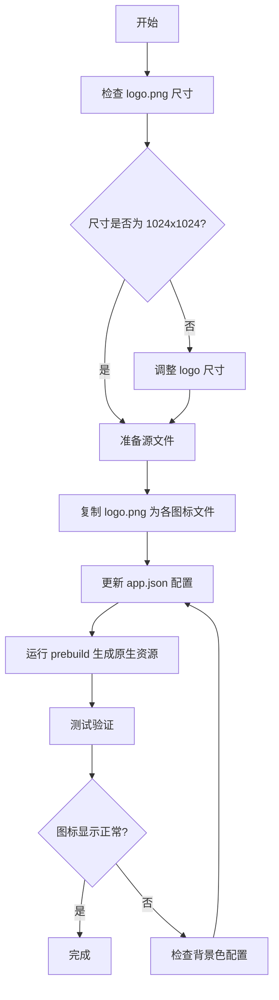

# APP图标替换技术方案

## 方案背景

当前 GoDad 应用使用的是 Expo 默认的灰色模板图标，导致用户在设备上看不到有辨识度的应用图标。项目中已有设计完成的品牌 logo（`assets/logo.png`，1024x1024px），需要将其应用为 APP 的各平台图标，提升品牌识别度和用户体验。

## 方案概要设计

使用 Expo 官方推荐的图标生成工具，从现有的 logo.png 自动生成符合 iOS、Android 和 Web 平台规范的应用图标，包括：
- iOS App 图标
- Android 自适应图标（Adaptive Icon）
- 启动屏幕图标
- Web 应用图标（Favicon）

## 方案详细设计

### 1. 技术选型

**工具**：使用 Expo CLI 内置的图标生成功能
**输入源文件**：`assets/logo.png`（1024x1024px PNG格式）
**输出文件**：
- `assets/icon.png` - iOS 应用图标
- `assets/adaptive-icon.png` - Android 自适应图标前景层
- `assets/splash-icon.png` - 启动屏幕图标
- `assets/favicon.png` - Web 应用图标

### 2. 实现流程



### 3. 实现步骤

#### 步骤1：复制 logo 为各平台图标文件
```bash
# 复制 logo 为 iOS 图标
cp assets/logo.png assets/icon.png

# 复制 logo 为 Android 自适应图标
cp assets/logo.png assets/adaptive-icon.png

# 复制 logo 为启动屏幕图标（如不存在）
cp assets/logo.png assets/splash-icon.png

# 复制 logo 为 Web 图标
cp assets/logo.png assets/favicon.png
```

#### 步骤2：验证 app.json 配置
确认 `app.json` 中图标路径正确配置：
```json
{
  "expo": {
    "icon": "./assets/icon.png",
    "splash": {
      "image": "./assets/splash-icon.png"
    },
    "android": {
      "adaptiveIcon": {
        "foregroundImage": "./assets/adaptive-icon.png",
        "backgroundColor": "#e76f51"
      }
    },
    "web": {
      "favicon": "./assets/favicon.png"
    }
  }
}
```

#### 步骤3：优化 Android 自适应图标背景色
由于当前 logo 是带白色背景的圆形图标，需要根据品牌色调整 Android 自适应图标的背景色。

当前配置：`#e76f51`（珊瑚色）

**可选方案**：
- 保持当前珊瑚色 `#e76f51`
- 使用启动屏背景色 `#fef7f0`（米白色）
- 使用白色 `#ffffff`

**建议**：使用启动屏背景色 `#fef7f0`，保持视觉一致性。

#### 步骤4：重新生成原生资源
```bash
# 清理旧的构建缓存
npx expo prebuild --clean

# 或直接重新构建
npx expo prebuild
```

#### 步骤5：重启开发服务器
```bash
# 停止当前服务
# Ctrl + C

# 重新启动
pnpm start
```

### 4. Android 自适应图标说明

Android 自适应图标由两层组成：
- **前景层（foregroundImage）**：logo 图案
- **背景层（backgroundColor）**：纯色背景

系统会根据设备制造商的设计自动裁剪成不同形状（圆形、圆角矩形、方形等）。

**安全区域**：为避免重要内容被裁剪，logo 的关键元素应在中心 66% 的区域内。

### 5. 配置文件变更清单

| 文件路径 | 变更类型 | 变更说明 |
|---------|---------|---------|
| `assets/icon.png` | 修改 | 替换为 logo.png |
| `assets/adaptive-icon.png` | 修改 | 替换为 logo.png |
| `assets/splash-icon.png` | 修改 | 替换为 logo.png |
| `assets/favicon.png` | 修改 | 替换为 logo.png |
| `app.json` | 可选修改 | 可优化 Android 背景色 |

## 影响范围

### 功能影响
- ✅ iOS 设备上的应用图标
- ✅ Android 设备上的应用图标
- ✅ Web 浏览器标签页图标
- ✅ 启动屏幕显示
- ✅ 应用商店展示图标

### 技术影响
- 需要重新生成原生平台代码（iOS/Android）
- 已安装的开发版本需要重新安装才能看到新图标
- 不影响应用的其他功能和代码

## 测试范围

### 测试项

| 测试项 | 测试方法 | 预期结果 |
|-------|---------|---------|
| iOS 应用图标 | 在 iOS 设备/模拟器上安装应用 | 主屏幕显示 GoDad logo |
| Android 应用图标 | 在 Android 设备/模拟器上安装应用 | 主屏幕显示 GoDad logo（自适应形状） |
| 启动屏幕 | 启动应用 | 启动屏显示 GoDad logo |
| Web 图标 | 在浏览器中打开 Web 版 | 标签页显示 GoDad favicon |
| 图标清晰度 | 查看不同尺寸显示 | 图标清晰无模糊 |
| Android 裁剪 | 在不同 Android 设备上测试 | logo 关键部分未被裁剪 |

### 测试设备建议
- **iOS**：iPhone（iOS 14+）或模拟器
- **Android**：真机或模拟器（Android 8.0+）
- **Web**：Chrome、Safari 浏览器

### 验证步骤
1. 重新安装应用到测试设备
2. 检查主屏幕图标是否显示为 GoDad logo
3. 启动应用，检查启动屏图标
4. 在不同设备上测试 Android 自适应图标的裁剪效果
5. Web 环境下检查浏览器标签页图标

## 开发任务与工时

| 任务编号 | 任务名称 | 功能描述 | 预计工时 |
|---------|---------|---------|---------|
| 1 | 图标文件准备 | 复制 logo.png 为各平台图标文件 | 5分钟 |
| 2 | 配置优化 | 检查并优化 app.json 配置（可选） | 3分钟 |
| 3 | 原生资源生成 | 运行 prebuild 生成原生平台资源 | 5分钟 |
| 4 | 测试验证 | 在 iOS/Android 设备上测试图标显示 | 10分钟 |
| **总计** | | | **约 25分钟** |

## 备注

1. **图标质量**：当前 logo.png 尺寸为 1024x1024px，完全符合要求，无需调整。
2. **背景色建议**：建议将 Android 自适应图标背景色从 `#e76f51` 改为 `#fef7f0`，与启动屏保持一致。
3. **缓存清理**：如果修改后图标未更新，需要卸载应用重新安装，或清理构建缓存。
4. **生产构建**：提交应用商店时，确保使用最新的图标资源进行构建。

## 参考资料

- [Expo App Icons 官方文档](https://docs.expo.dev/develop/user-interface/app-icons/)
- [Android Adaptive Icons 指南](https://developer.android.com/develop/ui/views/launch/icon_design_adaptive)
- [iOS App Icon 设计规范](https://developer.apple.com/design/human-interface-guidelines/app-icons)
