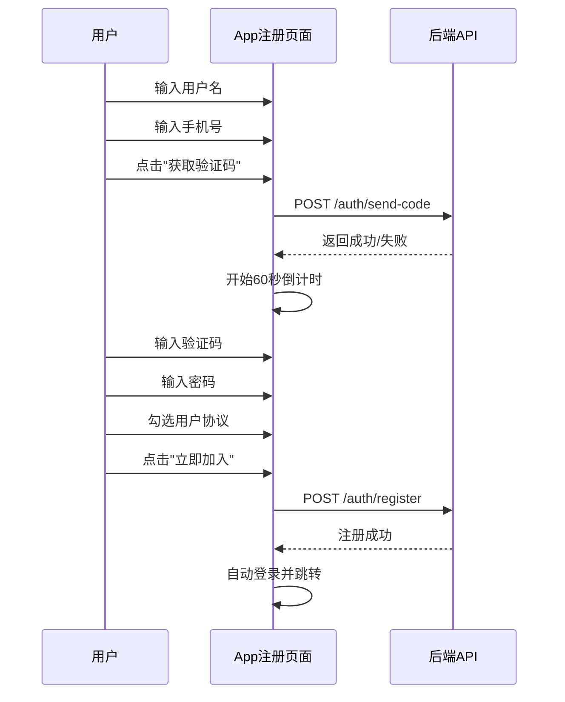

# App端注册页面与Web端同步技术方案

## 方案背景

当前App端注册页面与Web端存在以下差异，需要将App端修改为与Web端一致：

| 功能/字段 | Web端 | App端（当前） | App端（目标） |
|---------|------|-------------|-------------|
| 用户名 | ✅ 有 | ✅ 有 | ✅ 保留 |
| 手机号 | ✅ 有（11位） | ❌ 没有 | ✅ 新增 |
| 验证码 | ✅ 有（6位+获取按钮） | ❌ 没有 | ✅ 新增 |
| 昵称 | ❌ 没有 | ✅ 有 | ❌ 移除 |
| 密码 | ✅ 有 | ✅ 有 | ✅ 保留 |
| 确认密码 | ❌ 没有 | ✅ 有 | ❌ 移除 |
| 用户协议 | ✅ 复选框 | ⚠️ 仅文字 | ✅ 改为复选框 |
| 提交按钮 | "立即加入" | "注册" | "立即加入" |

## 方案概要设计

### 整体流程



## 方案详细设计

### 1. 文件变更清单

| 文件路径 | 操作 | 说明 |
|---------|-----|------|
| `app/(auth)/register.tsx` | 修改 | 注册页面UI和逻辑重构 |
| `src/api/auth.ts` | 修改 | 新增发送验证码API |
| `src/constants/config.ts` | 修改 | 新增发送验证码端点配置 |

### 2. API配置变更

**文件**: `src/constants/config.ts`

在 `ENDPOINTS.AUTH` 中新增：
```typescript
SEND_CODE: '/auth/send-code',
```

### 3. Auth API变更

**文件**: `src/api/auth.ts`

新增发送验证码方法：
```typescript
// 发送注册验证码
async sendRegisterCode(phone: string): Promise<ApiResponse<null>> {
  return http.post<null>(API_CONFIG.ENDPOINTS.AUTH.SEND_CODE, {
    phone,
    type: 'register'
  });
}
```

### 4. 注册页面重构

**文件**: `app/(auth)/register.tsx`

#### 4.1 状态变量变更

移除：
- `nickname`
- `confirmPassword`
- `showPassword`

新增：
- `phone` - 手机号
- `code` - 验证码
- `countdown` - 倒计时秒数
- `isSendingCode` - 是否正在发送验证码
- `agreedToTerms` - 是否同意用户协议

#### 4.2 新增方法

```typescript
// 发送验证码
const handleSendCode = async () => {
  // 1. 验证手机号格式
  // 2. 调用API发送验证码
  // 3. 开始60秒倒计时
}
```

#### 4.3 表单字段变更

| 字段 | 组件 | placeholder | 验证规则 |
|-----|------|-------------|---------|
| 用户名 | Input | "中英文均可" | 必填 |
| 手机号 | Input | "请输入11位手机号" | 必填，11位数字 |
| 密码 | Input | "设置密码" | 必填，至少6位 |
| 验证码 | Input + Button | "6位验证码" | 必填，6位数字 |
| 用户协议 | Checkbox | - | 必须勾选 |

#### 4.4 验证逻辑变更

```typescript
const handleRegister = async () => {
  // 1. 验证用户名（必填）
  // 2. 验证手机号（必填，11位）
  // 3. 验证密码（必填，至少6位）
  // 4. 验证验证码（必填，6位）
  // 5. 验证是否勾选用户协议
  // 6. 调用注册API
}
```

### 5. UI布局设计

```
┌────────────────────────────────────┐
│  创建账号                           │
│  加入 GoDad，开启育儿之旅            │
├────────────────────────────────────┤
│  ┌──────────────────────────────┐  │
│  │ 用户名                        │  │
│  │ [                          ] │  │
│  │ placeholder: 中英文均可       │  │
│  ├──────────────────────────────┤  │
│  │ 手机号                        │  │
│  │ [                          ] │  │
│  │ placeholder: 请输入11位手机号  │  │
│  ├──────────────────────────────┤  │
│  │ 密码                          │  │
│  │ [                    ] [👁]  │  │
│  │ placeholder: 设置密码          │  │
│  ├──────────────────────────────┤  │
│  │ 验证码                        │  │
│  │ [          ] [获取验证码/59s] │  │
│  │ placeholder: 6位验证码         │  │
│  ├──────────────────────────────┤  │
│  │ ☑ 我已阅读并同意 服务条款 和    │  │
│  │   隐私政策                     │  │
│  ├──────────────────────────────┤  │
│  │      [    立即加入    ]        │  │
│  └──────────────────────────────┘  │
├────────────────────────────────────┤
│     已有账号？ 立即登录              │
└────────────────────────────────────┘
```

## 数据库设计

无数据库变更，复用现有字段。

## 影响范围

1. **注册流程**：用户注册需要验证手机号
2. **API依赖**：需要后端提供 `/auth/send-code` 接口

## 测试范围

1. 用户名输入验证
2. 手机号格式验证（11位数字）
3. 发送验证码功能（含60秒倒计时）
4. 验证码输入验证（6位数字）
5. 密码输入验证（至少6位）
6. 用户协议复选框验证（必须勾选）
7. 注册成功后自动登录

## 接口文档

### 发送注册验证码

| 项目 | 说明 |
|-----|------|
| 接口说明 | 发送注册短信验证码 |
| 请求路径 | `/api/v2/auth/send-code` |
| 请求方法 | POST |

**请求参数**

| 参数名 | 类型 | 必填 | 说明 |
|-------|------|-----|------|
| phone | string | 是 | 11位手机号 |
| type | string | 是 | 验证码类型，固定为 "register" |

**响应参数**

| 参数名 | 类型 | 说明 |
|-------|------|------|
| code | number | 状态码，200为成功 |
| message | string | 提示信息 |

**响应示例**

```json
{
  "code": 200,
  "message": "验证码已发送"
}
```

## 开发任务与工时

| 任务 | 预估工时 |
|-----|---------|
| 修改API配置文件 | 0.5h |
| 新增发送验证码API方法 | 0.5h |
| 重构注册页面UI | 2h |
| 实现发送验证码逻辑（含倒计时） | 1h |
| 修改注册验证逻辑 | 1h |
| 测试与调试 | 1h |
| **合计** | **6h** |
