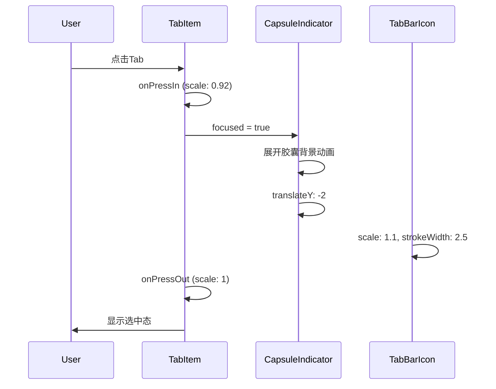
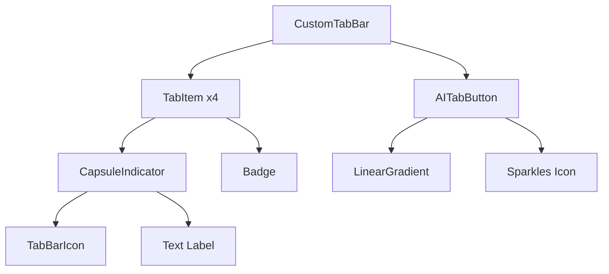

# 底部导航图标重设计技术方案

## 方案背景

当前App底部导航使用传统的Ionicons图标（home、document-text、chatbubbles、person），风格较为老旧，缺乏品牌识别度和现代感。本方案旨在通过更换图标库、优化选中态效果、添加流畅动画来提升用户体验。

## 方案概要设计

### 设计目标
1. 使用 Lucide 图标库替换 Ionicons（线条更精致、风格更现代）
2. 采用**胶囊指示器**作为选中态背景
3. 添加**弹性动画**增强交互体验
4. 保留中间AI Tab的浮动圆形设计

### 视觉效果预览

```
┌─────────────────────────────────────────────────────┐
│                                                     │
│   未选中态        选中态（胶囊背景）                   │
│                                                     │
│    ○              ┌─────────┐                       │
│   首页            │  ●  首页 │  ← 胶囊背景+图标放大    │
│                   └─────────┘                       │
│                                                     │
└─────────────────────────────────────────────────────┘
```

## 方案详细设计

### 1. 图标映射表

| Tab名称 | 当前图标(Ionicons) | 新图标(Lucide) | 设计说明 |
|--------|-------------------|----------------|---------|
| 首页 | `home-outline` / `home` | `House` | 现代简约房屋，线条更精致 |
| 文章 | `document-text-outline` / `document-text` | `BookOpen` | 打开的书本，更有阅读感 |
| 问AI | `sparkles-outline` / `sparkles` | `Sparkles` | 保持不变，AI闪烁感 |
| 广场 | `chatbubbles-outline` / `chatbubbles` | `MessageCircle` | 单个圆形气泡，更简洁现代 |
| 我的 | `person-outline` / `person` | `CircleUser` | 圆形头像，更亲和友好 |

### 2. 选中态效果设计

#### 胶囊指示器样式
```typescript
{
  backgroundColor: 'rgba(255, 155, 138, 0.15)', // 主题色15%透明度
  borderRadius: 20,
  paddingHorizontal: 16,
  paddingVertical: 8,
}
```

#### 动画参数
```typescript
const springConfig = {
  damping: 15,
  stiffness: 150,
  mass: 0.8,
};

// 选中时动画
- 胶囊背景: opacity 0→1, scale 0.8→1
- 图标: scale 1→1.1
- 整体: translateY 0→-2
```

### 3. 颜色方案

```typescript
const TabColors = {
  // 未选中态
  inactive: {
    icon: '#9CA3AF',      // gray-400
    label: '#9CA3AF',
  },
  // 选中态
  active: {
    icon: '#FF9B8A',      // primary-400
    label: '#FF9B8A',
    capsuleBg: 'rgba(255, 155, 138, 0.15)',
  },
};
```

## 文件变更清单

| 文件路径 | 操作 | 说明 |
|---------|------|------|
| `app/(tabs)/_layout.tsx` | 修改 | 核心变更文件，重构CustomTabBar组件 |
| `src/components/navigation/TabBarIcon.tsx` | 新增 | 封装Tab图标组件，支持动画 |
| `src/components/navigation/CapsuleIndicator.tsx` | 新增 | 胶囊指示器动画组件 |
| `src/constants/navigation.ts` | 新增 | 导航相关常量配置 |

## 核心代码设计

### 1. TabBarIcon 组件

```tsx
// src/components/navigation/TabBarIcon.tsx
import { House, BookOpen, Sparkles, MessageCircle, CircleUser } from 'lucide-react-native';
import Animated, { useAnimatedStyle, withSpring } from 'react-native-reanimated';

interface TabBarIconProps {
  name: 'home' | 'articles' | 'ai' | 'square' | 'profile';
  focused: boolean;
  color: string;
  size?: number;
}

const ICON_MAP = {
  home: House,
  articles: BookOpen,
  ai: Sparkles,
  square: MessageCircle,
  profile: CircleUser,
};

export function TabBarIcon({ name, focused, color, size = 24 }: TabBarIconProps) {
  const IconComponent = ICON_MAP[name];

  const animatedStyle = useAnimatedStyle(() => ({
    transform: [{ scale: withSpring(focused ? 1.1 : 1, springConfig) }],
  }));

  return (
    <Animated.View style={animatedStyle}>
      <IconComponent
        size={size}
        color={color}
        strokeWidth={focused ? 2.5 : 2}
      />
    </Animated.View>
  );
}
```

### 2. CapsuleIndicator 组件

```tsx
// src/components/navigation/CapsuleIndicator.tsx
import Animated, {
  useAnimatedStyle,
  withSpring,
  interpolateColor,
} from 'react-native-reanimated';

interface CapsuleIndicatorProps {
  focused: boolean;
  children: React.ReactNode;
}

export function CapsuleIndicator({ focused, children }: CapsuleIndicatorProps) {
  const animatedStyle = useAnimatedStyle(() => ({
    backgroundColor: focused
      ? 'rgba(255, 155, 138, 0.15)'
      : 'transparent',
    transform: [
      { scale: withSpring(focused ? 1 : 0.95, springConfig) },
      { translateY: withSpring(focused ? -2 : 0, springConfig) },
    ],
    opacity: withSpring(focused ? 1 : 0.8),
  }));

  return (
    <Animated.View style={[styles.capsule, animatedStyle]}>
      {children}
    </Animated.View>
  );
}

const styles = StyleSheet.create({
  capsule: {
    flexDirection: 'row',
    alignItems: 'center',
    paddingHorizontal: 12,
    paddingVertical: 6,
    borderRadius: 20,
    gap: 4,
  },
});
```

### 3. 重构后的 TabItem 组件

```tsx
function TabItem({
  config,
  focused,
  onPress,
  badge
}: TabItemProps) {
  const scale = useSharedValue(1);

  const color = focused ? Colors.primary[400] : '#9CA3AF';

  const handlePressIn = () => {
    scale.value = withSpring(0.92, { damping: 15, stiffness: 400 });
  };

  const handlePressOut = () => {
    scale.value = withSpring(1, { damping: 15, stiffness: 400 });
  };

  const containerStyle = useAnimatedStyle(() => ({
    transform: [{ scale: scale.value }],
  }));

  return (
    <Pressable
      onPress={onPress}
      onPressIn={handlePressIn}
      onPressOut={handlePressOut}
      style={styles.tabItem}
    >
      <Animated.View style={containerStyle}>
        <CapsuleIndicator focused={focused}>
          <TabBarIcon
            name={config.name}
            focused={focused}
            color={color}
          />
          {focused && (
            <Text style={[styles.tabLabel, { color }]}>
              {config.title}
            </Text>
          )}
        </CapsuleIndicator>
        {!focused && (
          <Text style={[styles.tabLabelUnfocused, { color }]}>
            {config.title}
          </Text>
        )}
        {badge !== undefined && badge > 0 && (
          <Badge count={badge} />
        )}
      </Animated.View>
    </Pressable>
  );
}
```

### 4. TAB_CONFIG 配置更新

```typescript
// 更新后的配置
const TAB_CONFIG: TabConfig[] = [
  { name: 'index', key: 'home', title: '首页' },
  { name: 'articles', key: 'articles', title: '文章' },
  { name: 'ai', key: 'ai', title: '问AI' },
  { name: 'square', key: 'square', title: '广场' },
  { name: 'profile', key: 'profile', title: '我的' },
];
```

## 动画流程图



## 组件架构图



## 影响范围

### 直接影响
- `app/(tabs)/_layout.tsx` - 底部导航布局
- 所有Tab页面的视觉呈现

### 间接影响
- 无（本次改动仅涉及UI层，不影响业务逻辑）

## 测试范围

| 测试项 | 测试内容 | 预期结果 |
|-------|---------|---------|
| 图标显示 | 各Tab图标正确渲染 | Lucide图标正常显示 |
| 选中态 | 点击切换Tab | 胶囊背景平滑展开 |
| 动画流畅度 | 快速切换Tab | 无卡顿，动画流畅 |
| AI Tab | 中间浮动按钮 | 保持原有效果 |
| Badge | 未读消息角标 | 正确显示在图标右上角 |
| 安全区域 | 底部安全区适配 | iPhone/Android正确适配 |
| 深色模式 | 切换系统主题 | 颜色正确响应（如已支持）|

## 开发任务拆解

| 任务 | 描述 | 预估工时 |
|-----|------|---------|
| 1. 创建TabBarIcon组件 | 封装Lucide图标+动画 | 20min |
| 2. 创建CapsuleIndicator组件 | 胶囊背景动画组件 | 20min |
| 3. 重构_layout.tsx | 集成新组件，更新样式 | 40min |
| 4. 调试动画参数 | 优化弹簧动画效果 | 20min |
| 5. 测试验证 | 真机测试各种场景 | 20min |
| **总计** | | **2h** |

---

*文档创建时间: 2024-12-03*
*作者: Claude Code*
