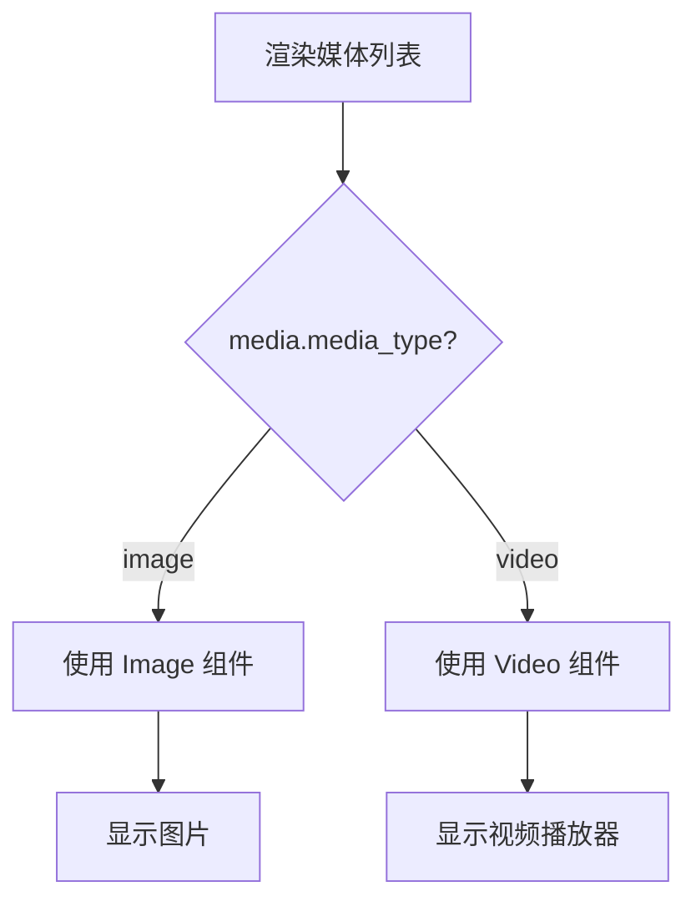

# 瞬间视频播放功能修复方案

## 方案背景

在广场页面的瞬间卡片中，用户发布的视频无法播放，只显示占位符。原因是 `MomentCard.tsx` 中没有根据 `media_type` 字段区分图片和视频，所有媒体都使用 `Image` 组件渲染。

## 方案概要设计

使用 `expo-av` 库提供的 `Video` 组件来播放视频类型的媒体，根据 `media.media_type` 字段判断渲染 `Image` 或 `Video` 组件。

## 方案详细设计

### 1. 安装依赖

```bash
pnpm add expo-av
```

### 2. 修改文件清单

| 文件路径 | 操作 | 描述 |
|---------|------|------|
| `src/components/MomentCard.tsx` | 修改 | 添加视频类型判断和 Video 组件渲染 |

### 3. MomentCard.tsx 核心变更

#### 3.1 新增导入

```tsx
import { Video, ResizeMode } from 'expo-av';
```

#### 3.2 修改媒体渲染逻辑

**原代码位置**: 第250-280行

**变更前**:
```tsx
{moment.media && moment.media.length > 0 && (
  <View style={styles.mediaContainer}>
    {moment.media.length === 1 ? (
      <Image
        source={{ uri: moment.media[0].url }}
        style={styles.singleImage}
        resizeMode="cover"
      />
    ) : (
      <View style={styles.imageGrid}>
        {moment.media.slice(0, 9).map((media, index) => (
          <Image
            key={media.id || index}
            source={{ uri: media.url }}
            style={[styles.gridImage, ...]}
            resizeMode="cover"
          />
        ))}
      </View>
    )}
  </View>
)}
```

**变更后**:
```tsx
{moment.media && moment.media.length > 0 && (
  <View style={styles.mediaContainer}>
    {moment.media.length === 1 ? (
      renderMediaItem(moment.media[0], true)
    ) : (
      <View style={styles.imageGrid}>
        {moment.media.slice(0, 9).map((media, index) => {
          const count = moment.media!.length;
          const isTwoColumn = count === 2 || count === 4;
          return (
            <View key={media.id || index} style={{ width: isTwoColumn ? '48.5%' : '32%' }}>
              {renderMediaItem(media, false)}
            </View>
          );
        })}
      </View>
    )}
  </View>
)}
```

#### 3.3 新增 renderMediaItem 函数

```tsx
const renderMediaItem = (media: MomentMedia, isSingle: boolean) => {
  if (media.media_type === 'video') {
    return (
      <Video
        source={{ uri: media.url }}
        style={isSingle ? styles.singleVideo : styles.gridVideo}
        resizeMode={ResizeMode.COVER}
        useNativeControls
        isLooping={false}
      />
    );
  }
  return (
    <Image
      source={{ uri: media.url }}
      style={isSingle ? styles.singleImage : styles.gridImage}
      resizeMode="cover"
    />
  );
};
```

#### 3.4 新增样式

```tsx
singleVideo: {
  width: '65%',
  height: 200,
  borderRadius: 16,
  backgroundColor: '#000',
},
gridVideo: {
  width: '100%',
  aspectRatio: 1,
  borderRadius: 12,
  backgroundColor: '#000',
},
```

## 流程图



## 4. 瞬间详情页修改 (app/moment/[id].tsx)

### 4.1 新增导入

```tsx
import { Video, ResizeMode } from 'expo-av';
import type { MomentReply, MomentMedia } from '../../src/types';
```

### 4.2 修改媒体渲染逻辑

**原代码位置**: 第303-316行

**变更后**:
```tsx
{/* 媒体（图片/视频） */}
{moment.media && moment.media.length > 0 && (
  <View className="mt-4">
    {moment.media.map((media: MomentMedia) => (
      media.media_type === 'video' ? (
        <Video
          key={media.id}
          source={{ uri: media.url }}
          className="w-full rounded-xl mb-2"
          style={{ aspectRatio: 16 / 9 }}
          resizeMode={ResizeMode.CONTAIN}
          useNativeControls
          isLooping={false}
        />
      ) : (
        <Image
          key={media.id}
          source={{ uri: media.url }}
          className="w-full rounded-xl mb-2"
          style={{ aspectRatio: 1 }}
          resizeMode="cover"
        />
      )
    ))}
  </View>
)}
```

## 影响范围

1. **广场页面** (`app/(tabs)/square.tsx`) - 瞬间列表中的视频可正常播放
2. **瞬间详情页** (`app/moment/[id].tsx`) - 详情页视频可正常播放
3. **用户个人页** - 如果展示用户瞬间，同样受益

## 测试范围

| 测试项 | 测试内容 |
|-------|---------|
| 视频播放 | 验证视频能正常加载和播放 |
| 播放控制 | 验证播放、暂停、进度条等控制功能 |
| 图片显示 | 验证图片媒体仍然正常显示 |
| 混合媒体 | 验证同时包含图片和视频的瞬间正常展示 |
| 单个媒体 | 验证只有一个视频时的展示效果 |
| 多个媒体 | 验证九宫格布局中视频的展示效果 |
